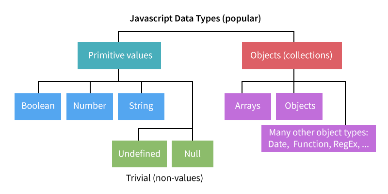
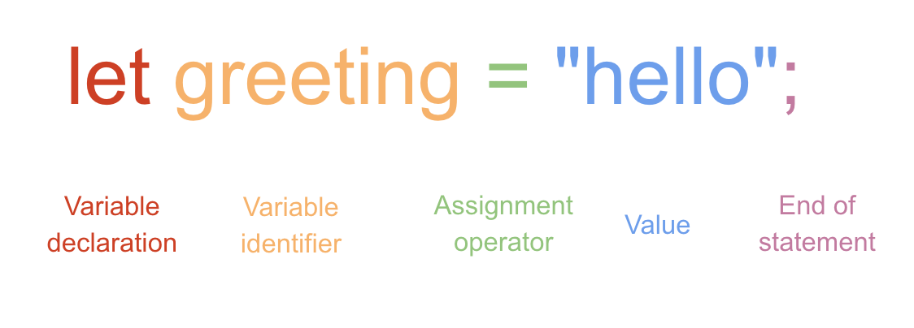

# Javascript 1-1

Introduction to Javascript, expressions, statements, and operators


<details>
<summary>Learning Objectives</summary> &nbsp;

Students who complete this module will be able to:

- Describe how to add Javascript to a web page.
- Compare data, expressions, and statements.
- List data types supported by Javascript

</details>


## What is Programming?

Programming is simply the act of “writing instructions for a computer.” Programming usually involves:

- **Flow** - The order in which statements are executed.
- **State** - The status of data (variables) in your program.
- **Logic** - Making decisions based on conditions (state).
- **Events** - Things that happen like user input, updated state.


## What is Javascript?

- Javascript is the programming language of the web.
- With Javascript you can change HTML or CSS of a page, respond to user events, animate or display content, and much more.
- Javascript can also run on a server, using Node.js.


## How to use Javascript

Javascript can run in multiple locations in your browser, as well as your computer (using Node).

In a **web page**, you can add Javascript inside a `<script>` element.

```html
<script>
	alert("hello world!");
</script>
```

or load it from an external `.js` file.

```html
<!-- index.html -->
<script src="assets/js/main.js"></script>
```

```js
// main.js
alert("hello world!");
```

Always add `<script>` tags at the end, right before the closing `</body>` tag, to be sure all the HTML elements have loaded and are ready to be used by your code.


👉 **Try it out** - A great place to test Javascript is right in the Console. Open DevTools and paste this into the console. You will see a simple HTML alert.

```js
alert("hello world!");
```


## Data

All programming languages use data to manage their state. Data has both a **value** and a **type**. Below, the **`boolean`** *type* can only have one of two *values*: `true` or `false`.

```js
true
false
```

Javascript is a loosely-typed language. This means Javascript will infer the data type of variables so you don't have to. Javascript organizes data by primitive and non-primitive types:



Javascript **`number`** type does not distinguish integer from float values.
```js
1
3.14
-491143422
```

The **`string`** type includes any character as its value, wrapped using a single `'words'` or double `"other words"` quotes. The number `3.14` below is technically a string because it is wrapped in quotes.
```js
"hello world 🥰"
'3.14'
`strings wrapped
 using back ticks support
 multiple lines`
```

A later lesson will discuss types categorized as `Objects` (collections like `arrays`, `objects`, `Date`, etc.).
```js
[4,1,2]
{key: "value"}
new Date()
```


## Expressions

An expression is any unit of code that can be **evaluated**. Expressions are the fundamental building blocks of all code.

Typically a program will return a value when it runs an expression. If you pass data to Javascript it will simply return the data's value. However, if you preceed it with an operator like [`typeof`](https://developer.mozilla.org/en-US/docs/Web/JavaScript/Reference/Operators/typeof) it will return the data's *type*.

👉 **Try it out** - Run these lines in the Console to test their type. Try some of the above and below as well.

```js
33
typeof 33
```

This expression uses an arithmetic operator to multiply two values. The Javascript engine will evaluate the expression and return a number: `144`.
```js
12 * 12
```

`>` and `<` are comparison operators that will return a boolean value: `false`
```js
4 > 5
```

The double `==` equal sign is also a comparison operator that will return true if a value is the same:, `true`
```js
1 == 1
```

The triple `===` equal sign is specific to Javascript and will compare the value **and the type**: `false`
```js
1 === "1"
```


<!-- You can convert the type using Number('3.14') -->


The data, conditions, and events of Javascript can be seen at work in [this lamp demo](https://omundy.github.io/learn-javascript/1-1/demos/javascript-lamp/index.html)


## Statements

A statement is any instruction to perform a specific action.


#### Syntax




For the most part, whitespace doesn't matter. This code,

```js
if (true) { console.log("with whitespace"); }
```

and this, are the same:

```js
if (true)
{
    console.log("with whitespace");
}
```

#### Comments and Whitespace

Comments can be used to add notes about code. They are not evaluated when the program runs.


```js
// a single line comment
/* a
 multi-line
    comment */
```


## Resources

- DIG 245 Javascript lecture [slides](https://docs.google.com/presentation/d/1mTMY_jT3nVvrdE2JNrFNVsRBjnFFf90LhKB3W-2w3Fg/edit#slide=id.g3f99f37dc1_8_39)
