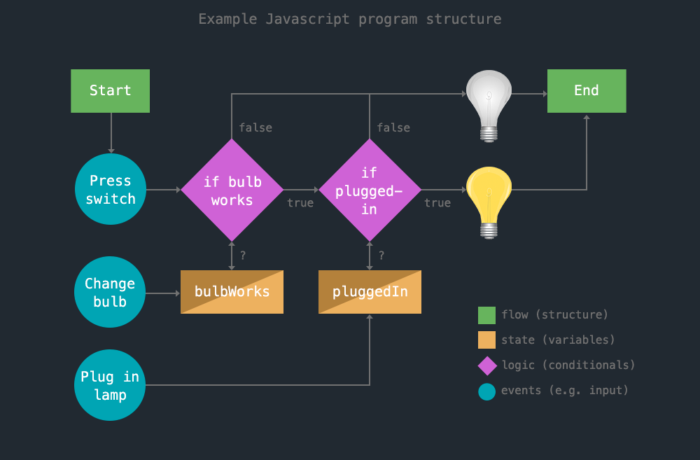

← [Learn Javascript](../README.md)


# Javascript 1-0

Introduction to Javascript, expressions, statements, and operators


## Introduction

Review the following sections and perform the activities on your own or with your group.

<details>
<summary>Learning Objectives</summary>

Students who complete this module will be able to:

- Describe three methods to run Javascript in web browser (a web page, code playground, and console).
- List data types supported by Javascript.
- Compare Javascript data, expressions, and statements.

</details>

<details>
<summary>Contents</summary>

1. [Introduction](#introduction)
1. [What is Programming?](#what-is-programming) `2 min`
1. [What is Javascript?](#what-is-javascript) `2 min`
1. [How to use Javascript](#how-to-use-javascript) `5 min`
1. [Data Types](#data-types) `5 min`
1. [Expressions](#expressions) `5 min`
1. [Statements](#statements) `5 min`
1. [Next steps](#next-steps)
1. [Exercise](#exercise)
1. [References](#references)

</details>


## What is Programming?

Programming is simply the act of “writing instructions for a computer to execute.” Programming usually involves:

- **Flow** - The order in which statements are executed.
- **State** - The status of data (variables) in your program.
- **Logic** - Making decisions based on conditions (state).
- **Events** - Things that happen, like user input, that may change the state.


[](1-0-demos/javascript-lamp/)

<sup>A [flowchart](1-0-demos/javascript-lamp/) showing the flow or structure of a “turn the lamp on” program. Note the logic (decisions the computer makes) based on state (the status of variables in your program) and events (e.g. user input) directing the computer towards its goal.</sup>


## What is Javascript?

Javascript is the programming language of the web. With Javascript you can

- change HTML, CSS, or content of a web page
- respond to user events, animate or display content or media
- (using Node.js) run on a server, query to databases, publish mobile apps
- and much more.


## How to use Javascript

Javascript can run in multiple locations in your browser, as well as your computer (using Node).

You can add Javascript to a **web page** inside a `<script>` element.

```html
<script>
alert("hello world!");
</script>
```

or load it into your page from an external `.js` file.

```html
<!-- index.html -->
<script src="assets/js/main.js"></script>
```

```js
// main.js
alert("hello world!");
```

⚠️ Always add `<script>` tags at the end, right before the closing `</body>` tag, to be sure all the HTML elements have loaded and are ready to be used by your code.


👉 **Try it out** - There are two other great places to test Javascript.

1. **In the Console** - Open DevTools and paste this into the console. You will see a simple HTML alert.

```js
alert("hello world!");
```

2. **Code playgrounds** like [jsfiddle.net](https://jsfiddle.net) and [codepen.io](https://codepen.io/) make it easy to quickly test and share Javascript in a "web environment" (you can also add HTML and CSS files). Here are some examples from class: [Random Article Generator](https://codepen.io/owenmundy/pen/PomvjqW), [Javascript / jQuery Cat Image Swapper](https://codepen.io/owenmundy/pen/OJRWQoY), [Choropleth map with Mapbox](https://jsfiddle.net/ow3n/sw6ek1wb/). Add the code above to one of these playgrounds to test it out.


## Data Types

All programming languages use data to manage their state. Data has both a **value** and a **type**. Below, the **`boolean`** *type* can only have one of two *values*: `true` or `false`.

```js
true
false
```

Javascript is a loosely-typed language. This means Javascript will infer the data type of variables so you don't have to. Javascript organizes data by primitive and non-primitive types:


The Javascript **`number`** type does not distinguish integer from float values.
```js
1
3.14
-491143422
```

The **`string`** type includes any character as its value, wrapped using a single `'words'` or double `"other words"` quotes. The number `3.14` below is technically a string because it is wrapped in quotes.
```js
"hello world 🥰"
'3.14'
`strings wrapped
 using back ticks support
 multiple lines`
```

A later lesson will discuss types categorized as `Objects` (collections like `arrays`, `objects`, `Date`, etc.).
```js
[4,1,2]
{key: "value"}
new Date()
```


## Expressions

An [expression](https://developer.mozilla.org/en-US/docs/Web/JavaScript/Guide/Expressions_and_Operators) is any unit of code that resolves to a value. Expressions are the fundamental building blocks of code, and use [operators](https://www.w3schools.com/js/js_operators.asp) to perform assignments, math, logic, or string calculations.


👉 **Try it out** - Read about and test the following expressions in the Console.

1. **Primary expressions** - If you pass data to Javascript it will simply **return** the data's value.

```js
12
```

2. However, if you use an [arithmetic operator](https://developer.mozilla.org/en-US/docs/Web/JavaScript/Guide/Expressions_and_Operators#arithmetic_operators), Javascript will **evaluate** the code, multiplying the values to return a new value: `144`.

```js
12 * 12
```

3. If you use the [`typeof`](https://developer.mozilla.org/en-US/docs/Web/JavaScript/Reference/Operators/typeof) operator, Javascript will return a string describing the data's *type*.

```js
typeof 12
```

4. The following [comparison operators](https://developer.mozilla.org/en-US/docs/Web/JavaScript/Guide/Expressions_and_Operators#comparison_operators) will return a logical `boolean` value based on whether the comparison in the expression is true.

```js
4 > 5
```

The [equality operator](https://developer.mozilla.org/en-US/docs/Web/JavaScript/Reference/Operators/Equality) `==` checks to see if two values are equal, `true`

```js
1 == 1
```

The [inequality operator](https://developer.mozilla.org/en-US/docs/Web/JavaScript/Reference/Operators/Inequality) `!=` checks whether its two operands are *not equal*.

```js
1 != 1
```


The [strict equality operator](https://developer.mozilla.org/en-US/docs/Web/JavaScript/Reference/Operators/Strict_equality) `===` will compare the value **and type**, and is specific to Javascript. **What will these return?**

```js
1 === "1"
```

<details>
<summary>Solution</summary>

A: It will return `false` because `1` is a `number` and `"1"` is a `string`.

</details>


If you combine expressions, Javascript will evaluate each in the appropriate order. **What will these return?**

```js
typeof (4 > 5)
typeof (typeof (4 > 5))
```

<details>
<summary>Solution</summary>

`4 > 5` uses a comparison operator so it will return `false`. But since `typeof` returns a string, the first line will return `"boolean"` (note the double quotes), and the second line will return `"string"`

</details>


## Statements

A statement is any instruction to perform a specific action. I like to think of a statement as a sentence—they even have punctuation (a semicolon `;`) at the end to tell Javascript the instruction is complete. The statement in the diagram uses an [assignment operator](https://developer.mozilla.org/en-US/docs/Web/JavaScript/Guide/Expressions_and_Operators#assignment_operators) to assign a value to variable, `greeting`, on the left.


These are statements with **side effects**. Instead of returning a value, they evaluate the expression and then produce some other effect. The built-in `alert()` function opens a popup window to show the value that is returned from the expression.

```js
alert(1 + 1);
console.log(1 < 2);
```


## Next steps

1. Review additional information in the [slides](https://docs.google.com/presentation/d/1mTMY_jT3nVvrdE2JNrFNVsRBjnFFf90LhKB3W-2w3Fg/edit#slide=id.g3f99f37dc1_8_39) that accompany this section.
1. Try example expressions in the [Exercise](#exercise) below.
1. Continue learning about [Javascript variables](1-1-variables.md) in the next lesson.


## Exercise

👉 **Try it out** - Example Expressions

Expand the section below to view more example expressions. See if you can guess the return value of each before you run them in your browser dev console or a code playground.

<details>
<summary>Example Expressions</summary>

```js
1 == 1
1 === 1
1 === "1"
1 == true
1 === true
1 != false
1 !== false
100 == 100
100 == "100"
1 != 2
true != false
true != !false
true != !!false
true != !!!!!!!!false
Math.random()*100
Math.ceil(1.2)
/[aeiouAEIOU]/.test(123)
/[aeiouAEIOU]/.test("b")
/[aeiouAEIOU]/.test("a")
```


</details>


## References

- Madhu M [JavaScript Expressions and Statements](https://medium.com/launch-school/javascript-expressions-and-statements-4d32ac9c0e74) (2018)
