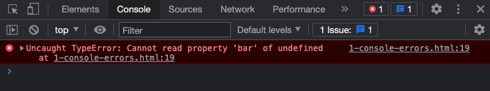

← [Introduction](1-0-introduction.md) | [Control Flow](1-2-control-flow.md) →

<a href="../../README.md"></a>

# 1-1 Variables

How to store and compare values and data types


## Contents

1. [Introduction](#introduction)
1. [Add Javascript to a web page](#add-javascript-to-a-web-page) `3 min`
1. [Keep the Console open](##keep-the-console-open) `3 min`
1. [Variables](#variables) `5 min`
1. [Syntax](#syntax) `5 min`
1. [Next steps](#next-steps)
1. [Exercises](#exercises)
1. [References](#references)


## Introduction

Review the following sections and perform the activities on your own or with your group.

<details>
<summary>Learning Objectives</summary>

Students who complete this module will be able to:

- Demonstrate how to install Javascript in a web page.
- Explain why and how to use comments in Javascript.
- Use Javascript to create and use variables.
- List common syntax issues when programming Javascript.

</details>

<details>
<summary>Homework</summary>

- [Codecademy: JS 1-1 Introduction to Javascript](https://www.codecademy.com/learn/introduction-to-javascript) (1–8)
- [Codecademy: JS 1-2 Variables](https://www.codecademy.com/learn/introduction-to-javascript) (1–6)

**Assessment**: Quiz 1

</details>


## Add Javascript to a web page

You can add Javascript to a **web page** inside a `<script>` element, or load it into your page from an external `.js` file. The browser will run your code when it loads the page, or in response to a user’s actions.

Using an external `.js` file is usually preferred because, like external CSS, a single file used across your whole site makes your code easier to edit and maintain. View this page [demos/0-hello.html](demos/0-hello.html).

```js
// 0-hello.js
console.log("Hello from an external Javascript file!");
```

```html
<!-- 0-hello.html -->
<!DOCTYPE html>
<html>
<head>
<meta charset="UTF-8">
<title>Learning Javascript</title>
<style>
    body { font-family: sans-serif; }
</style>
</head>
<body>
<h1>Javascript "hello world!"</h1>

<script src="0-hello.js"></script>
<script>

alert("hello from the script tag!");

</script>
</body>
</html>
```


#### ⚠️ Order matters

Load external files into an HTML page in the following order:

1. **CSS** - Ensure HTML elements and content can access the styles *before* they display, unstyled.
1. **HTML** - All visible content comes next.
1. **Javascript** - Always add `<script>` tags at the end, right before the closing `</body>` tag, to be sure all the HTML elements have loaded and are ready to be used by your code.


## Keep the Console open


In the example above, the Console displayed a message from the `console.log()` **function**, as well as the line number where it was called in your code.


<sup>View this file: [demos/0-hello.html](demos/0-hello.html)</sup>


If you have warnings or errors in your code then the Console will show a red error flag and log the error message and line where it happened.



<sup>View this file: [demos/1-console-errors.html](demos/1-console-errors.html)</sup>


Tips for using the Console:

- If the Console shows it recognizes what you are typing, press "Tab" to autocomplete.
- Press the up ↑ arrow to see the last command you entered.
- You can add multiple expressions to `console.log()` function by separating them with commas.
- Keep the Console open when coding Javascript so it will show you warnings and errors from your code.

👉 **Try it out** - Tricks for the console

Run these in the DevTools Console

```js
console.log("hello", "world!");
console.log(true, 1, 3.14, "abc");
```


## Variables


Variables are used to store values in your program.

My favorite visual for thinking about variables is a water bottle. Like variables, you can put things in water bottles, and get them back out later when you need to.

Refer to the below diagram of the anatomy of a Javascript statement from the previous lesson. Reading from the left, this statement

1. Creates a new variable named `greeting`
1. **Assigns** the string `"hello"` as the value (using the assignment operator)


> The assignment process is also referred to as "binding", because the data is actually stored in the memory of the computer, not the variable.


### var, let, and const

The Javascript language is based on the [ECMAScript standard](https://developer.mozilla.org/en-US/docs/Web/JavaScript/Language_Resources), which in 2015 (ES6) added support for two new variable declaration keywords. The differences between the original method `var`, and the additions, `let` and `const`, mainly have to do with scope, which determines where these variables are able to be accessed.

With the original method `var`, variables could be redeclared and globally accessed. [This creates some issues](https://www.freecodecamp.org/news/var-let-and-const-whats-the-difference/).

- With `let` and `const`, you can't use a variable before it is declared.
- With `let` and `const`, declarations can only be accessed within the block `{ ... }` they were declared.
- Variables declared using `const` cannot be updated or re-declared


### Update the value stored in a variable

Just like a water bottle, you can replace the value stored in a variable.

👉 **Try it out** - What is the value in `myVar` after each of these statements? Feel free to [check the documentation](https://www.w3schools.com/js/js_operators.asp) on the `+` operator.

```js
var myNumber = 1000; // -> ?
myNumber = myNumber + 10; // -> ?
myNumber += 10; // -> ?
myNumber ++; // -> ?
myNumber += "10"; // -> ?
```

<details>
<summary>Solution</summary>

1. `1000` is stored in the new variable
1. `1010` - `10` was added to `1000`
1. `1020` - Shorthand for the previous line
1. `1021` - The increment operator increase by `1`
1. `"102110"` - Whenever you use the `+` operator and any string, then all data types are converted to strings and "concatenated," or merged together into one long string.

</details>


👉 **Try it out** - Examine code examples

1. View the source of this page [demos/2-variables.html](demos/2-variables.html).
1. Try to determine what each `console.log()` function will output?
1. Open the console to verify.


### Variable data types

Unlike some other languages, with Javascript, you don’t have to supply a data type when you create a variable. That said, Javascript still keeps track of data types.

👉 **Try it out** - How to explicitly change a variable type

1. Examine the lines below.
1. Try to determine what each `console.log()` function will output?
1. Open the console to verify.

```js
let answer = true;
console.log(answer, typeof answer);
answer = Number(answer);
console.log(answer, typeof answer);
answer = String(answer);
console.log(answer, typeof answer);
answer = Boolean(answer);
console.log(answer, typeof answer);
```

<details>
<summary>Solution</summary>

```js
true "boolean"
1 "number"
1 string
true "boolean"
```
</details>


👉 **Try it out** - Storing and using complex data types

You can store complex types like the [Date Object](https://www.w3schools.com/jsref/jsref_obj_date.asp) in variables as well.

Run these lines in the Console to see the output. The last line concatenates the value of question, an empty space, and the return value of a logical expression.

```js
// bind a string
let question = "Can we celebrate yet?";
// store an instance of the date object
let today = new Date();
console.log(typeof today);
// concatenate the string binding with the return value from an expression
console.log(question + " " + (today.getFullYear() > 2020))
```


## Syntax

While slightly more forgiving than other languages, Javascript still requires your syntax to be correct or your code won’t work as expected. For example, it is a good practice to always include the trailing semicolon. Read on for more tips and suggestions:


### Comments

Comments can be used to add notes about code. They are preceded by `//` or enclosed by `/* ... */` and are not evaluated when the program runs.


```js
// a single line comment
/* a multiline
comment */
```


### Whitespace

Whitespace, like spaces, tabs, and line breaks, in your code can help make it readable. These examples will be executed the same.

```js
// without whitespace
if (true) { console.log(123); }
// with whitespace
if (true)
{
    console.log(123);
}
```

Some rich text editors will also have hidden whitespace characters that can cause errors. Copying / pasting code from Slack sometimes cause this issue.


### Smart quotes

Take care when copying / pasting from rich text editors (like Word or HTML pages) which sometimes use smart quotes (a.k.a. “curly quotes”). Note in the example below how the text color formatting is broken on the first example. Smart quotes are not acceptable for wrapping string data and will cause errors.

```js
“ An example string with smart quotes 😿 ”
" An example string with dumb quotes 😀 "
```

👉 **Try it out** - Locate a syntax error in the console

1. View the source of this page [demos/3-syntax-quotes.html](demos/3-syntax-quotes.html).
1. Try to determine what line number console will report for the error?
1. Open the console to verify.


### Use a linter

Using a Javascript Linter in your code editor can save hours of frustration. My preference is [jshint](https://atom.io/packages/linter-jshint) but there are others packages available. You can also use a web version like [jshint.com](https://jshint.com) or [jslint.com](https://www.jslint.com/).


## Next steps

1. Review additional information in the [slides](https://docs.google.com/presentation/d/1mTMY_jT3nVvrdE2JNrFNVsRBjnFFf90LhKB3W-2w3Fg/edit#slide=id.ga0a6e47c90_0_44) that accompany this section.
1. Try examples in the [Exercises](#exercises) below.
1. Start working on homework listed in the schedule.
1. Continue learning about Control Flow in the [next lesson](../1-2-control-flow/control-flow.md).


## Exercises

👉 **Try it out** - ???

Expand the section below to view ...


## References

- Haverbeke [Introduction](https://eloquentjavascript.net/00_intro.html) (1-8)
- Haverbeke [Ch1 Values, Types, and Operators](https://eloquentjavascript.net/01_values.html) (10-20)
- Haverbeke [Ch2 Program Structure](https://eloquentjavascript.net/02_program_structure.html) (22-26)
- Codecademy Cheatsheet(s) [Javascript Introduction](../../reference-sheets/js-01-introduction.pdf)
- W3schools [installation](https://www.w3schools.com/js/js_whereto.asp), [variables](https://www.w3schools.com/js/js_variables.asp), [syntax](https://www.w3schools.com/js/js_syntax.asp), [comments](https://www.w3schools.com/js/js_comments.asp)
