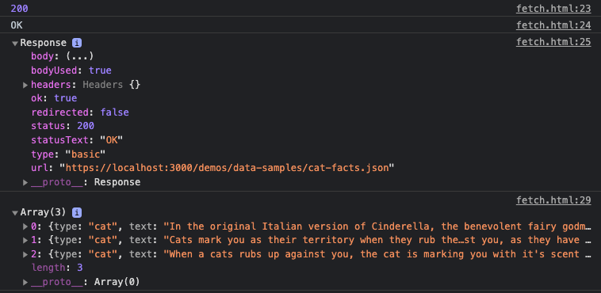

# Javascript – Working with Data

"<em>Above all else, show the data.</em>"– Edward R. Tufte


<!-- TOC depthFrom:2 depthTo:3 withLinks:1 updateOnSave:1 orderedList:0 -->

- [Data Collection Types](#data-collection-types)
	- [Arrays](#arrays)
	- [Objects](#objects)
- [Using External Data](#using-external-data)
	- [Tabular Data (CSV, TSV, etc.)](#tabular-data-csv-tsv-etc)
	- [JSON Data](#json-data)
	- [CORS](#cors)
	- [How to get data from an API](#how-to-get-data-from-an-api)
	- [Export Google Sheets data for your project](#export-google-sheets-data-for-your-project)
- [Tips for Storing Data](#tips-for-storing-data)
	- [Static Data](#static-data)
	- [Flat files](#flat-files)
	- [Storage](#storage)
- [Data Cleaning](#data-cleaning)
	- [How to clean data using find / replace with regex](#how-to-clean-data-using-find-replace-with-regex)
- [Data Conversion](#data-conversion)
	- [Export spreadsheet data, convert CSV to JSON](#export-spreadsheet-data-convert-csv-to-json)
- [FAQ & Tips](#faq-tips)
- [Other Tutorials](#other-tutorials)

<!-- /TOC -->


## Data Collection Types

In addition to [primitive data types](https://developer.mozilla.org/en-US/docs/Glossary/Primitive) ...

```js
let bool = true;
let num = 3.14;
let str = "hello world";
```
Javascript has built-in structural types to store complex entities, hierarchical collections, and lists.


### Arrays

A Javascript [Array](https://developer.mozilla.org/en-US/docs/Web/JavaScript/Reference/Global_Objects/Array) is a list of values, separated by commas. Arrays are zero-indexed, and their values can be set or retrieved using their index.
```js
const numberArr = [-2, -1, 0, 1, 2]; // array of numbers
const colorArr = ["red", "green", "blue"]; // array of strings
console.log(colorArr[0]); // -> "red"
```

Arrays can also store other arrays
```js
const tableArr = [
	['name', 'age', 'favoriteColor'],
	['Mary', 18, 'mauve'],
	['Chalet', 81, 'chartreuse']
];
```
as well as complex objects.
```js
// array of date objects
const dates = [
	new Date(Date.UTC(1989, 10, 9, 17, 53, 0)), // UTC
	new Date("9 November 1989 18:53 UTC+1"), // BERLIN
	new Date("November 9, 1989 12:53 UTC-5") // NYC
];
console.log(dates[1].toUTCString()); // -> "Thu, 09 Nov 1989 17:53:00 GMT" (Berlin local time)
```


### Objects

A Javascript [Object](https://developer.mozilla.org/en-US/docs/Web/JavaScript/Reference/Global_Objects/Object) stores `key:value` relationships where `key` is a string, and `value` can be a primitive, array, or object. The values are then references by their keys using either square brackets or dot notation.
```js
const color = {
	name: "red",
	hex: "#ff0000",
	rgb: [255,0,0]
}
console.log(color.name); // -> "red"
console.log(color['name']); // -> "red"
```

You can also store functions ([called methods when stored inside an object](https://medium.com/predict/javascript-functions-vs-methods-and-other-helpful-tips-e58a621b1d27)).
```js
const ev = {
	name: "Fall of the Berlin Wall",
	link: "https://en.wikipedia.org/wiki/Fall_of_the_Berlin_Wall",
	date: new Date(Date.UTC(1989, 10, 9, 17, 53, 0)),
	timeZone: "CET",
	getLocalTimeStr: function(){
		return this.date.toLocaleString('de-DE', {timeZone: this.timeZone})
	}
};
console.log(`${ev.name}, ${ev.date.getUTCFullYear()}`); // -> "Fall of the Berlin Wall, 1989"
console.log(ev.getLocalTimeStr()); // -> "9.11.1989, 18:53:00"
```


## Using External Data

Datasets can be stored within a Javascript file, as in the previous examples, or imported into your program from an external file, database, or API server. When you import data from an external source, typically tabular (CSV, TSV) or JSON data, it arrives as a string (serialized) and must then be deserialized (converted to readable Javascript arrays or objects) before you can use it in your program.


### Tabular Data (CSV, TSV, etc.)

[Tabular data](https://www.w3.org/TR/tabular-data-model/), like a spreadsheet or database table, is structured into rows and columns. It is most often exported as comma (CSV) or tab-separated values (TSV), though you can technically delineate the columns with any unique character. Each row should contain the same number of columns, even if the cell is empty. Following are the contents of [`demos/data-samples/temps.csv`](demos/data-samples/temps.csv) shown as an HTML table ...

C | F | description
--- | --- | ---
-273.15 | -459.67 | absolute zero temperature
0 | 32.0 | freezing/melting point of water
21 | 69.8 | room temperature
37 | 98.6 | average body temperature
100 | 212 | boiling point of water


shown as serialized data in a plain text CSV file ...
```data
C, F, description
-273.15, -459.67, absolute zero temperature
0, 32.0, freezing/melting point of water
21, 69.8, room temperature
37, 98.6, average body temperature
100, 212, boiling point of water
```

and finally, as deserialized Javascript code. A two-dimensional array is the closest equivalent data structure in Javascript for tabular data, depending on your application you may want to [convert it to JSON](https://www.npmjs.com/package/csvtojson) so the columns can be referenced by their keys.
```js
const tempsArr = [
	[-273.15, -459.67, 'absolute zero temperature'],
	[0, 32.0, 'freezing/melting point of water'],
	[21, 69.8, 'room temperature'],
	...
];
```


### JSON Data

[Javascript Object Notation (JSON)](https://developer.mozilla.org/en-US/docs/Web/JavaScript/Reference/Global_Objects/JSON) is a hierarchical data format for storing serialized Javascript objects. While similar to a Javascript object, JSON is different in that
- JSON is serialized (a string)
- JSON cannot store methods
- JSON has [a stricter syntax](https://jsonlint.com/) (e.g. JSON keys must be wrapped in double quotes).

```json
{
    "name": "red",
    "hex": "#ff0000",
    "rgb": [255,0,0]
}
```

#### Serialization and Deserialization

Data imported from an external source (e.g. [this random cat facts API](https://alexwohlbruck.github.io/cat-facts/docs/) saved at [`demos/data-samples/cat-facts.json`](demos/data-samples/cat-facts.json)) is technically a `string` when Javascript imports it. That is to say, all readable objects have been [serialized](https://en.wikipedia.org/wiki/Serialization) into string data so that it can be stored, or sent across a network.

```string
[{"type": "cat","text": "In the original Italian version of Cinderella, the benevolent fairy godmother figure was a cat."},{"type": "cat","text": "Cats mark you as their territory when they rub their faces and bodies against you, as they have scent glands in those areas."},{"type": "cat","text": "When a cats rubs up against you, the cat is marking you with it's scent claiming ownership."}]
```

Thus to use external data you must conversely [*deserialize*](https://developer.mozilla.org/en-US/docs/Glossary/Deserialization) the string into a data structure that Javascript can use. For example, if using `fetch()` you can deserialize the body with [`response.json()`](https://developer.mozilla.org/en-US/docs/Web/API/Body/json) ...
```js
fetch('../data-samples/cat-facts.json') // request an external resource
    .then(response => {
        console.log(response.status); // -> 200
	    console.log(response.statusText); // -> "OK"
	    console.log(response); // log the response object
        return response.json(); // parse response body (convert to JSON)
    })
    .then(data => {
        console.log(data); // log the object
    });
```



#### Converting JSON to string or vice versa

Convert a string to JSON with [`JSON.parse()`](https://developer.mozilla.org/en-US/docs/Web/JavaScript/Reference/Global_Objects/JSON/parse), and back to a string with [`JSON.stringify`](https://developer.mozilla.org/en-US/docs/Web/JavaScript/Reference/Global_Objects/JSON/stringify)
```js
// string > json
const str = '{"name":"Sue","favColor":"purple"}';
console.log(JSON.parse(str));

// json > string
const obj = {
	name: "Joe",
	favColor: "pink"
};
console.log(JSON.stringify(str));
```


### CORS

[Cross-Origin Resource Sharing](https://developer.mozilla.org/en-US/docs/Web/HTTP/CORS) (CORS) controls how Javascript *in the browser* can access external resources. This means you may only import files from *the same* [origin](https://developer.mozilla.org/en-US/docs/Glossary/Origin)...

- A script at `https://foo.com` ***can*** [`fetch()`](https://developer.mozilla.org/en-US/docs/Web/API/Fetch_API/Using_Fetch) a file of the same origin `https://foo.com/data.json`

But ([unless the other server enables it](https://expressjs.com/en/resources/middleware/cors.html)), you cannot access data across origins:

- A script at `https://foo.com` ***cannot*** access a resource at a different origin `https://bar.com/data.json`

CORS also says that to use the fetch() API, 'URL schemes must be "http" or "https" for CORS request'. So...

- Even though they have the same `file://` protocol, a script at `file:///Users/username/coolwebsite/index.html` ***cannot*** fetch() `file:///Users/username/coolwebsite/data.json`


### How to get data from an API

1. Read the documentation
	- Many APIs require that you register and make requests using a key or token.
		- For example, when [requesting data](https://pro.dp.la/developers/requests#url) from the [DPLA](https://dp.la/) you must include your `api_key` in the request `https://api.dp.la/v2/items?q=kittens&api_key=<here>`
	- Many APIs use rate limiting to prevent abuse. They identify your requests using your key.
1. Start with a tool that makes it easy to see what is returned:
	- Use the browser + [JSON Viewer extension](https://chrome.google.com/webstore/detail/json-viewer/gbmdgpbipfallnflgajpaliibnhdgobh?hl=en-US)
	- Use [Postman](https://www.postman.com/) to test an API
1. Start coding once you are sure your requests are working
	- Save sample responses locally so you can develop your application with test data without bumping into a rate limit.
1. Things to remember
	- APIs introduce latency so use asynchronous programming (`async`/`await`, promises, etc.)
	- If your code isn't working check that the API is returning results using a browser or Postman.
	- APIs are always changing based on needs and resources. In the early days of Facebook and Instagram anyone (artists, researchers, [anti-press authoritarian governments](https://www.scu.edu/ethics-spotlight/social-media-and-democracy/weaponization-of-social-media-by-authoritarian-states/)) could collect their entire databases via their APIs. Thanks to various [cultural](https://iknowwhereyourcatlives.com/) works [this](https://givememydata.com/) is no longer the case.


Some example APIS


- [Public APIs](https://github.com/public-apis/public-apis) - A collective list of free APIs for use in software and web development
- [Data / Functionality API Resource List](https://docs.google.com/spreadsheets/d/196CgwxBIkX5v6VeitOFWTYfd07OU_5A-HC4Gu7gy6xE/edit#gid=0) - My own list
- [Digital Public Library of America API](https://pro.dp.la/developers/api-codex)
- [JSON Placeholder](https://jsonplaceholder.typicode.com/) - Free fake API for testing and prototyping.


### Export Google Sheets data for your project

Follow below, or their [tutorial](https://developers.google.com/sheets/api/quickstart/nodejs). Also see [documentation](https://developers.google.com/sheets/api)

1. [Enable](https://developers.google.com/sheets/api/quickstart/nodejs#step_1_turn_on_the) the Google Sheets API
1. [Install](https://developers.google.com/sheets/api/quickstart/nodejs#step_2_install_the_client_library) the client library
1. [Setup and run the sample](https://developers.google.com/sheets/api/quickstart/nodejs#step_3_set_up_the_sample)


## Tips for Storing Data

When you use data in a project you should address which of the following applies to your application:

1. Is your data **static** (unchanging) or **dynamic** (and how often does it changes)?
1. Do you need to **insert** or **update** data (from users, a scraper, or other means)?
1. Will you need to **query** the data (by searching, sorting, etc.)?
1. How much data will you need to **store** or **request** across a network?
1. What data **formats** do you have / will you need?
1. Do you need to **clean** or **transform** your data (e.g. some fields are incorrect or need to be altered)?
1. Do all of your datasets need to be treated the same?

Some example situations:

- I already have a spreadsheet, but it has many columns I do not need `static`, `clean`
- I want users to be able to add, edit, and search content (see )

 (perhaps some collections are large but static, but others user-submitted but)


### Static Data

Static data is content that you download into your own project and doesn't change.

- You can clean, modify, or improve it


### Flat files

A "flat file" is any single or collection of plain text files that store data (e.g. CSV, TSV, JSON, etc.)

1. Pros
	1. Easy to store, and can be
	1. You can write
1. Cons
	1. "Queries" (searching or sorting these files) can require a lot of time
	1.


### Storage


#### Browser-based storage

- localStorage
- cookies

#### Databases

A database


## Data Cleaning


### How to clean data using find / replace with regex

Let's say we want to copy and paste [these advertising categories](https://developers.google.com/adwords/api/docs/appendix/verticals) into a spreadsheet where all the tiers are represented in their own columns.

1. Select all, copy, and paste them into a new document in Atom.
1. Press CMD+F (CTL+F) to search for all the `/` (forward slashes) in the text.
1. Copy and paste a tab character into the replace field. [Whitespace characters](https://en.wikipedia.org/wiki/Whitespace_character) (tabs, spaces, line breaks) are invisible, but you can still use them in search or replace.
1. Now press Find All, then Replace All to
1. Select all, copy, and paste back into the spreadsheet, which will recognize that we are pasting tab-separated content and add each field to its own column.

We could do the same with [these stock symbols](ftp://ftp.nasdaqtrader.com/symboldirectory/nasdaqtraded.txt), which will require a slightly more involved find/replace action.

1. Select all, copy, and paste them into a new document in Atom.
1. Searching for all the pipes `|` shows some of what we do and don't want.
1. Enabled Regular Expressions and Case Sensitive in Atom
1. Search for each of the following
 	1. `[A-Z]` - Any capitalized letters
	1. `[A-Z]{1,5}` - Any capitalized letters, one to five characters long
 	1. `^[A-Z]{1,5}` - Any capitalized letters, one to five characters long, at the start of a string
 	1. `(^[A-Z]{1,5})` - Wrap this match in a capture group
	1. `(^[A-Z]{1,5})+(.*)` - Add a second group that matches any number of any character
1. Add to the replace `$1` to copy the result of the first capture group
1. And Find All / Replace All

We could make these stock symbols into a Javascript array using

1. Find `(^[A-Z]{1,5})` and Replace: `'$1',`
1. Adding `const arr = [` to the beginning and `];` to the end


## Data Conversion

### Export spreadsheet data, convert CSV to JSON

1. Download a CSV from your spreadsheet
1. Use Node and [csvtojson](https://www.npmjs.com/package/csvtojson) to convert the file
1. Save as a file using [`writeFile`](https://www.w3schools.com/nodejs/nodejs_filesystem.asp)


## FAQ & Tips


## Other Tutorials

- Daniel Shiffman's - Working with Data & APIs in Javascript ([playlist](https://www.youtube.com/playlist?list=PLRqwX-V7Uu6YxDKpFzf_2D84p0cyk4T7X))
	- [Introduction](https://www.youtube.com/watch?v=DbcLg8nRWEg&list=PLRqwX-V7Uu6YxDKpFzf_2D84p0cyk4T7X&index=1) and [Setup](https://www.youtube.com/watch?v=hPbDyqzxQfU&list=PLRqwX-V7Uu6YxDKpFzf_2D84p0cyk4T7X&index=2)
	- [1.1 fetch()](https://www.youtube.com/watch?v=tc8DU14qX6I&list=PLRqwX-V7Uu6YxDKpFzf_2D84p0cyk4T7X&index=3)
	- [1.2 Tabular Data](https://www.youtube.com/watch?v=RfMkdvN-23o&list=PLRqwX-V7Uu6YxDKpFzf_2D84p0cyk4T7X&index=4)
	- [1.3 Graphing with Chart.js](https://www.youtube.com/watch?v=5-ptp9tRApM&list=PLRqwX-V7Uu6YxDKpFzf_2D84p0cyk4T7X&index=5)
	- [1.4 JSON](https://www.youtube.com/watch?v=uxf0--uiX0I&list=PLRqwX-V7Uu6YxDKpFzf_2D84p0cyk4T7X&index=6)
	- [1.6 Refreshing Data with setInterval()](https://www.youtube.com/watch?v=jKQUHGpOHqg&list=PLRqwX-V7Uu6YxDKpFzf_2D84p0cyk4T7X&index=8)
	- [2.1 Server-side with Node.js](https://www.youtube.com/watch?v=wxbQP1LMZsw&list=PLRqwX-V7Uu6YxDKpFzf_2D84p0cyk4T7X&index=9)
	- [2.2 Geolocation Web API](https://www.youtube.com/watch?v=3ls013DBcww&list=PLRqwX-V7Uu6YxDKpFzf_2D84p0cyk4T7X&index=10)
	- [2.3 HTTP Post Request with fetch()](https://www.youtube.com/watch?v=Kw5tC5nQMRY&list=PLRqwX-V7Uu6YxDKpFzf_2D84p0cyk4T7X&index=11)
	- [2.4 Saving to a Database](https://www.youtube.com/watch?v=xVYa20DCUv0&list=PLRqwX-V7Uu6YxDKpFzf_2D84p0cyk4T7X&index=12)
	- [2.5 Database Query](https://www.youtube.com/watch?v=q-lUgFxwjEM&list=PLRqwX-V7Uu6YxDKpFzf_2D84p0cyk4T7X&index=13)
	- [2.6 Saving Images and Base64 Encoding](https://www.youtube.com/watch?v=9Rhsb3GU2Iw&list=PLRqwX-V7Uu6YxDKpFzf_2D84p0cyk4T7X&index=14)
	- [2.7 Project Wrap-up: Accessibility and Design](https://www.youtube.com/watch?v=1mnpn6q25FI&list=PLRqwX-V7Uu6YxDKpFzf_2D84p0cyk4T7X&index=15)
	- [3.1 API calls from Node.js (Weather data from Dark Sky)](https://www.youtube.com/watch?v=ZtLVbJk7KcM&list=PLRqwX-V7Uu6YxDKpFzf_2D84p0cyk4T7X&index=16)
	- [3.2 Open Air Quality API in Node.js](https://www.youtube.com/watch?v=Tiot877orkU&list=PLRqwX-V7Uu6YxDKpFzf_2D84p0cyk4T7X&index=17)
	- [3.3 Mapping Database Entries with Leaflet.js](https://www.youtube.com/watch?v=r94kI6my0QQ&list=PLRqwX-V7Uu6YxDKpFzf_2D84p0cyk4T7X&index=18)
	- [3.4 Hiding API Keys with Environment Variables (dotenv) and Pushing Code to GitHub](https://www.youtube.com/watch?v=17UVejOw3zA&list=PLRqwX-V7Uu6YxDKpFzf_2D84p0cyk4T7X&index=19)
	- [3.5 Web Application Deployment (Glitch and Heroku) ](https://www.youtube.com/watch?v=Rz886HkV1j4&list=PLRqwX-V7Uu6YxDKpFzf_2D84p0cyk4T7X&index=20)
