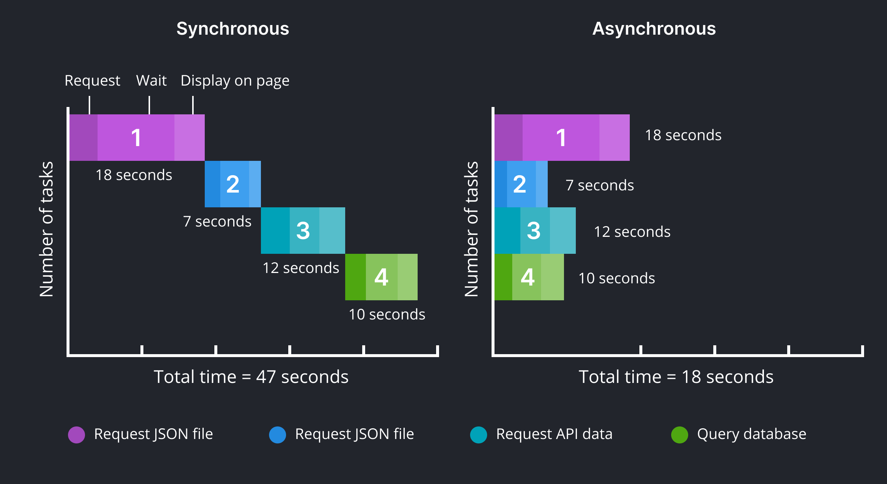
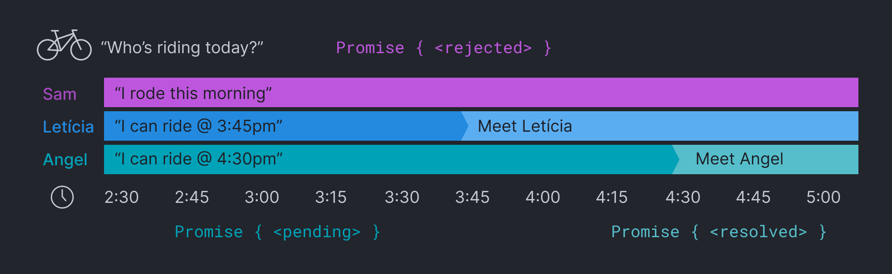

<!-- paginate: true -->

← [Learn Javascript](../../)

<a href="../../"></a>

# Asynchronous Javascript

Using callbacks, fetch, promises, async/await, etc.

<span class="slides-small"><a href="slides.html">slides</a> | <a href="async.md">md</a></span>

<!--
Presentation comments ...
-->


---

## Sync vs. Async

**Latency** describes the time it takes to retrieve data across the web.

<div class="twocolumn">
<div class="col">

**Synchronous** code runs in succession, after previous lines have finished.

```js
console.log(1, "These will...");
console.log(2, "execute");
console.log(3, "in order");
// -> 1 These will...
// -> 2 execute
// -> 3 in order
```

<!-- <details class="slides-small">
<summary>What is the order?</summary>
Left: 1,2; Right: 2,1<br>
</details> -->

</div>
<div class="col">

**Asynchronous** code can handle requests that depend on data from the response.


```js
console.log(1, "1st.");
setTimeout(function(){
	console.log(2, "2nd");
}, 1000);
console.log(3, "3rd");
// -> 1 1st...
// -> 3 3rd
// -> 2 2nd
```

</div>
</div>


---

## Async code

Here are some ways you can deal with latency in Javascript:

1. Event Handlers
1. Callbacks
1. Promises & Async/Await


---

## Event Handlers

If you have used event listeners then you are already know <a href="https://developer.mozilla.org/en-US/docs/Learn/JavaScript/Asynchronous/Introducing#event_handlers" target="_blank">Event Handlers</a>.

```js
// vanilla JS
let btn = document.querySelector('button');
btn.addEventListener('click', () => {
	console.log("click!!");
});
```

<small>
<details>
<summary>jQuery</summary>

```js
$("button").click(function() {
	console.log("click!!");
});
```

</details>
</small>


---

## Callbacks

- A **callback** is a function that is passed to another function, to be called once the function is complete.
- The function from the previous slide can also be stored in a variable instead...

```js
let btn = document.querySelector('button');
// callback stored in variable
let callback = function() { 
	console.log("click!!"); 
}
// use just the function name (adding "()" will call it immediately)
document.querySelector("button").addEventListener("click", callback);
```


<small>
<details>
<summary>jQuery</summary>

```js
// callback stored in variable
let callback = function() {
	console.log("click!!");
}
$("button").click(callback);
```

</details>
</small>


---

## Callback Hell

Since callbacks require nesting functions, it makes your code difficult to manage.

```js
let arr = []; 
getUser(id1, function(user1){
	arr.push(user1.name);
	if (user1.friends.length > 0){
		getUser(user1.friends[0], function(user2){
			arr.push(user2.name);
			if (user2.friends.length > 0){
				// and so on until done...
			}
		});
	}
});
getUser(1); // get a list of connections
```


---



<div class="slides-small">Synchronous code (with multiple embedded callbacks) is also slower</div>


---

## Promises



<div class="slides-small">
	A JS <a href="https://developer.mozilla.org/en-US/docs/Learn/JavaScript/Asynchronous/Promises" target="_blank">promise</a> lets you make asynchronous requests and use the result when a response is received.
</div>


---

## Promises

- Javascript's `fetch()` returns a promise tells the calling function the request is in progress.

```js
fetch('https://api.weather.gov/')
// -> Promise {<pending>}
// ->   [[Prototype]] : Promise 
// ->   [[PromiseState]] : "fulfilled"
// ->   [[PromiseResult]] : Response
```


---

## Fetch

- The `fetch()` response is handled using a **promise chain** where each `.then()` is performed in order.
- Below, the response is converted to JSON object in the first `then`, and finally logged to the console in the 2nd.


```js
fetch('https://jsonplaceholder.typicode.com/todos')
	.then(response => response.json())
	.then(json => {
		console.log(json);
	});
```


--- 

## Async/Await

- Use **async/await** to wait for a promise to be fulfilled. 
- Remove `await` <a href="https://codepen.io/owenmundy/pen/WNVaewo?editors=1011" target="_blank">in the example</a> to change the order

```js
(async function(){ 
  // 1st
  console.log("⭐️ first");
  
  // 2nd - 👉 remove the await keyword to change the order
  await fetch("https://jsonplaceholder.typicode.com/todos")
    .then((response) => response.json())
    .then((json) => console.log(json[0]));
  
  // 3rd
  console.log("🟢 last");
})()
```


--- 

## Fetch in a function

```js
async function fetchFunction(){
    let jsonData;
    await fetch('https://jsonplaceholder.typicode.com/todos')
        .then(response => response.json())
        .then(json => { jsonData = json; });
    return jsonData;    
}
```

<div class="slides-small">
Codepen <a href="https://codepen.io/owenmundy/pen/dyKOveX?editors=1011" target="_blank">fetch() in a function (random user)</a> or <a href="https://codepen.io/owenmundy/pen/dyKMRBN?editors=1011" target="_blank">fetch() - Why we need asynchronous code</a>
</div>


<!--
FROM THE OLD REPO, NEED TO DELETE OR INTEGRATE

```js
// callback example
function log(answer) {
	console.log("The answer is " + answer);
}
function sum(n1, n2, callback) {
	// sum n1, n2 and invoke callback function
	callback(n1 + n2);
}
// pass a function as a callback
sum(5, 5, log);

// promise example
function waitForPromise(param) {
	return new Promise(resolve => {
		setTimeout(() => {
			resolve(param);
		}, 2000);
	});
}
// async function
async function test() {
	let str = "";
	// use await to wait for promise in synchronous code
	str += await waitForPromise("🤡");
	console.log(str);
	str += await waitForPromise(" lurks");
	console.log(str);
	str += await waitForPromise(" in the shadows");
	console.log(str);
}
test();
```

-->


---

## Next steps

1. Explore [./demos](./demos).
1. Try the [Exercises](#exercises) below.
1. Start working on homework listed in the schedule.
1. Continue to the [next lesson](../../).


---

## Exercises

👉 **Try it out**

1. Ch11 [Tracking the scalpel](https://eloquentjavascript.net/11_async.html#i_UvyahfUnfl), [Building Promise.all](https://eloquentjavascript.net/11_async.html#i_Ug+Dv9Mmsw)


## References

- Codecademy Cheatsheet(s) [promises](reference-sheets/js-12-promises.pdf), [async-await](reference-sheets/js-13-async-await.pdf), [Requests](reference-sheets/js-14-requests.pdf)
- w3schools [callbacks](https://www.w3schools.com/js/js_callback.asp), [asynchronous](https://www.w3schools.com/js/js_asynchronous.asp), [promises](https://www.w3schools.com/js/js_promise.asp), [async-await](https://www.w3schools.com/js/js_async.asp), [fetch](https://www.w3schools.com/js/js_api_fetch.asp)
- [Modern Asynchronous JavaScript with Async and Await](https://nodejs.dev/learn/modern-asynchronous-javascript-with-async-and-await)
- Haverbeke: [Ch11 Asynchronous Programming](https://eloquentjavascript.net/11_async.html) (180-201)


---

## Resources 

- ([Working with Data & APIs in Javascript](https://www.youtube.com/playlist?list=PLRqwX-V7Uu6YxDKpFzf_2D84p0cyk4T7X)) by Daniel Shiffman

