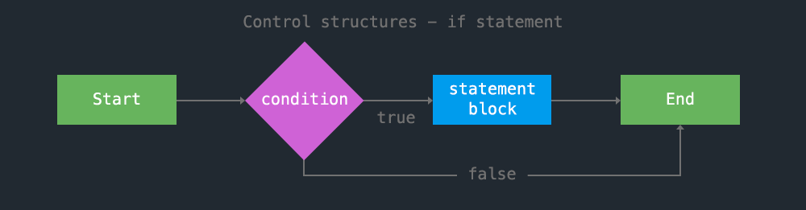
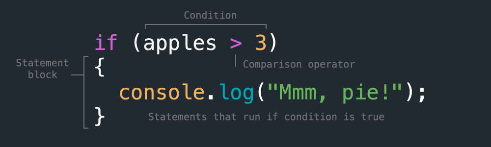
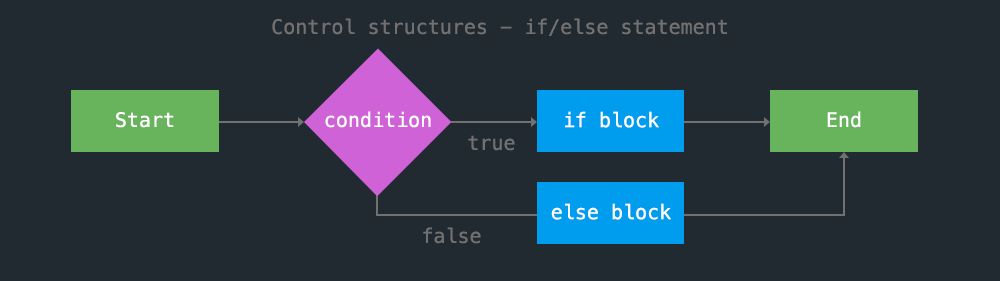

<!-- paginate: true -->

← [Learn Javascript](../../)

<a href="../../"></a>

# Control Flow

Comparison and logical operators, conditional statements

<span class="slides-small"><a href="slides.html">slides</a> | <a href="control-flow.md">md</a></span>

<!--
Presentation comments ...
-->


---

## Contents

1. [Introduction](#introduction)
1. [Operators](#operators) `5 min`
1. [Conditions](#conditions) `5 min`
1. [Combining conditionals with logical operators](#combining-conditionals-with-logical-operators) `5 min`
1. [Next steps](#next-steps)
1. [Exercises](#exercises)
1. [References](#references)


---

## Introduction

Review the following sections and perform the activities on your own or with your group.

Perform the task(s) when you see this 👉  emoji

<details>
<summary>Learning Objectives</summary>

Students who complete this module will be able to:

- Demonstrate how to use arithmetic and assignment operators.
- Explain how conditional statements can control the flow of a program
- Use Javascript to create a simple gradebook using conditional statements

</details>

<details>
<summary>Homework</summary>

- [Codecademy: JS 2-1 Conditional Statements ](https://www.codecademy.com/learn/introduction-to-javascript) (1–8)
- [Codecademy: HTML 3-1 Forms](https://www.codecademy.com/learn/learn-html) (1-14)
- [Codecademy: HTML 3-2 Form Validation](https://www.codecademy.com/learn/learn-html) (1-6)
- Quiz - JS Control Flow

</details>


---

## Operators

Let's review some of the [operators](https://www.w3schools.com/js/js_operators.asp) we've seen thus far.


---

### [Arithmetic operators](https://www.w3schools.com/js/js_arithmetic.asp)

Perform addition `+`, subtraction `-`, multiplication `*`, division `/` on numbers

```js
1 + 1 // -> 2
3.14 * 2 // -> 6.28
```

Increment `++` or decrement `--` a value

```js
let count = 1;
count ++; // -> 2
count --; // -> 1
```


---

### [Arithmetic operators](https://www.w3schools.com/js/js_arithmetic.asp)

Modulus `%` to return the remainder from a division operation

```js
5 % 2 = 1
```

The `+` operator is also used to concatenate (add) strings

```js
"Hello" + " world!" // -> "Hello world!"
```


---

### [Assignment operators](https://www.w3schools.com/js/js_assignment.asp)

Perform an expression and then assign the value.

```js
let apples = 100;
```

These operators can be used to add and assign number values ...

```js
apples ++; // -> 101
apples += 10; // -> 111
```

... or to (convert and) concatenate and assign strings.

```js
apples += " apples"; // -> "111 apples"
```


---

### [Comparison operators](https://www.w3schools.com/js/js_comparisons.asp)

A double `==` compares values only then returns `true` or `false`. If operands of different types are used, Javascript will first convert to the type **on the left** and compare.

```js
1 == 1 // -> true
1 == "1" // -> true
1 != 2  // -> true
```

The triple `===` checks value and type

```js
1 === "1" // -> false
```

Greater than / greater than or equal to

```js
2 > 1 // -> true
3 <= 2 // -> false
```


---

## Conditions

Control flow determines which code is executed and the order in which it will happen. To illustrate this, first consider the default behavior of Javascript.


As the program runs, it will execute the instructions it finds, line by line, until the end.

```js
let apples = 0;
apples = apples + 10;
console.log(`We have ${apples} apples!`);
```


---

## Conditions

However, this is not very interesting. Instead, you will want your code to perform *different* actions depending on the **state** of variables in your program. Use **conditionals** to do this.



In the above diagram, an **`if`** statement is used to either run the statement block, or not, depending on whether the condition is true or false.


---

## Conditions


Here is the syntax for a basic `if` statement.



In this case, if of `apples` is a number greater than 3, then the message will be logged to the console.


---

## Conditions

We can use an **`else`** to execute different code, if the first condition is not met.




---

## Conditions


Here is `else` in practice:

```js
let apples = 2;
if (apples > 3) {
	console.log("we can make pie!")
} else {
	console.log("we need more apples")
}
```

---

## Conditions

We can use `if` `if/else` and `else` together like so:

```js
let apples = 2;
if (apples > 5) {
	console.log("we can make cider!")
} else if (apples > 3) {
	console.log("we can make pie!")
} else {
	console.log("we need more apples")
}
```


---

## Combining conditionals with logical operators

Finally, we can combine conditional statements with logical operators to account for more than one variable in a program. [Logical operators](https://www.w3schools.com/js/js_comparisons.asp) are used to determine how to combine true and false values using logical and `&&`, or `||`, not `!`.


Use `&&` ("and") to test if ***both*** expressions are `true`

```js
(1 < 2 && 3 > 4) // -> false
```


---

## Combining conditionals with logical operators


Use `||` ("or") to test if ***either*** expression is `true`

```js
(1 < 2 || 3 > 4) // -> true
```

Use `!` ("not") to test if the expression is ***not*** `true`

```js
!true // -> false
!false // -> true
!(1 < 2) // -> false
```


---

## Combining conditionals with logical operators

And, putting it all together, evaluate more than one condition in an if, if else statement


```js
let apples = 2, // a comma separates multiple variable declarations
    blueberries = 4;

if (apples >= 2 && blueberries >= 4) {
	console.log("we can make fruit salad")
} else if (apples > 3 || blueberries > 2) {
	console.log("we can make pie!")
} else {
	console.log("we need more fruit")
}
```


---

## Next steps

1. Try the [Exercises](#exercises) below.
1. Start working on homework listed in the schedule.
1. Continue to the [next lesson](../../README.md#javascript-part1).


---

## Exercises

👉 **Try it out**

1. [Lottery v.1](../../topics/games/the-lottery/README.md) - Build your first game!
1. [Gradebook](../../topics/single-page-apps/grade-book/README.md) - Code a gradebook app using conditions, functions, and jquery.
1. Revisit [this lamp demo](../../topics/single-page-apps/javascript-lamp/index.html) to explore how it uses conditions.


---

## References

- Haverbeke [Ch2 Program Structure](https://eloquentjavascript.net/02_program_structure.html) (22-26)
- Codecademy Cheatsheet(s) [Conditionals](../../reference-sheets/js-02-conditionals.pdf)
- W3schools [operators](https://www.w3schools.com/js/js_operators.asp), [assignment](https://www.w3schools.com/js/js_assignment.asp), [arithmetic](https://www.w3schools.com/js/js_arithmetic.asp), [comparisons](https://www.w3schools.com/js/js_comparisons.asp), [conditions](https://www.w3schools.com/js/js_if_else.asp), [output](https://www.w3schools.com/js/js_output.asp)
