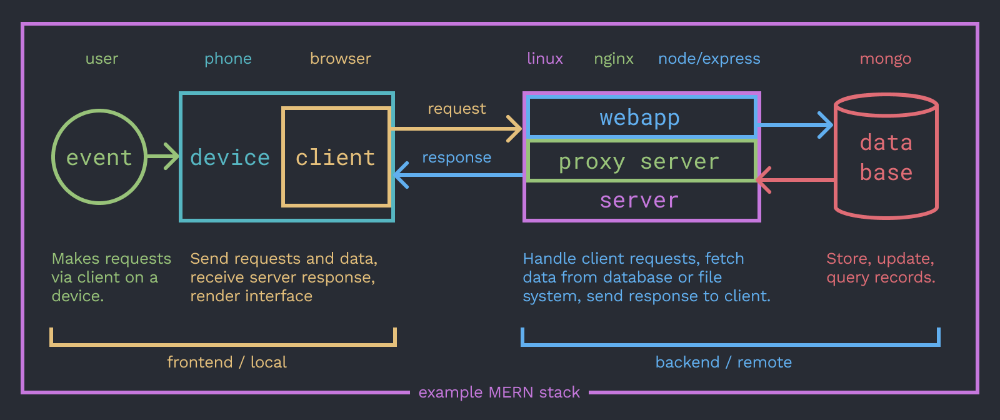
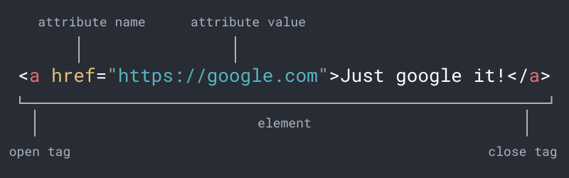
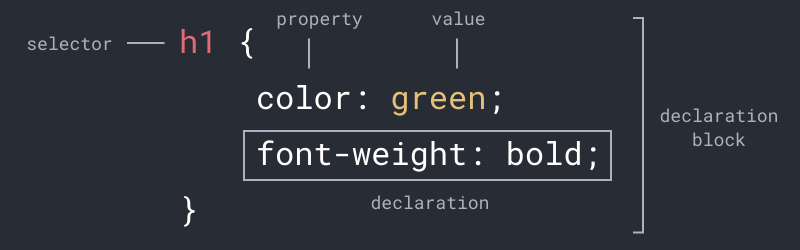
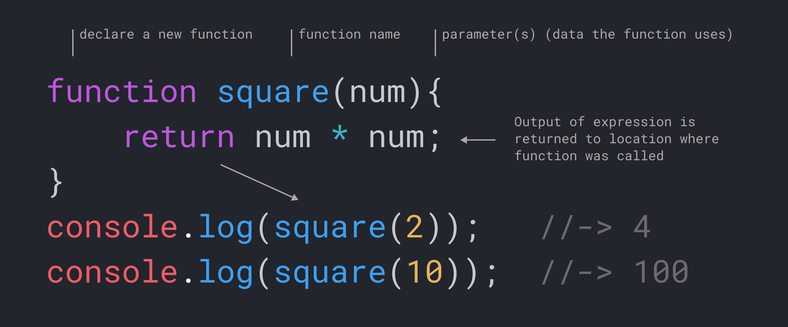

<!-- paginate: true -->

← [Learn Javascript](../../)

<a href="../../"></a>

# Full Stack Crash Course

Command line > HTML > CSS, DevTools, Javascript, Node, NPM, SPIs, Databases

<span class="slides-small"><a href="slides.html">slides</a> | <a href="functions.md">md</a></span>

<!--
Presentation comments ...
-->


---

## Introduction

Review the following sections and perform the activities on your own or with your group. Perform the task(s) when you see this 👉  emoji

<details>
<summary>Learning Objectives</summary>

Students who complete this module will be able to:

- Explain the essential components of a full stack web application
- Create a web page that uses HTML, CSS, Javascript, and Bootstrap
- Run a simple hello world web application with Node/NPM/Express

</details>


---

## What is Full Stack Development?



A stack describes the essential technology components of a given website or application 


---

## HTML

<div class="twocolumn">
<div class="col">

- HTML (HyperText Markup Language) structures and organizes information in web pages
- HTML elements can contain text or other elements between an open and close tag.
- Every HTML document has a `head` and `body` element, nested inside the root `html` element. 

</div>
<div class="col">

```html
<html>
	<head>
		<title>The head 
			contains meta data</title>
	</head>
	<body>
		<p>The body contains 
			visible content</p> 
	</body>
</html>	
```

<!-- <div class="caption slides-small"></div> -->

</div>
</div>


---

## HTML Attributes



HTML attributes add information to elements, in this case *wrapping* "Just google it!" will create a link.


---

## CSS




---

## Javascript





---

## Next steps

1. Explore [More Concepts](#more-concepts) at the end
1. Try the [Exercises](#exercises) below.


---

## Exercises

👉 **Try it out**

1. [Lottery v.2](https://omundy.github.io/learn-javascript/topics/games/the-lottery/) - Show results of the game in HTML
1. [Gradebook](../../topics/single-page-apps/grade-book/README.md) - Code a gradebook app using conditions and functions.
1. Revisit [this lamp demo](../../topics/single-page-apps/javascript-lamp/index.html) to explore how it uses functions


---

## References

- Haverbeke [Ch3 Functions](https://eloquentjavascript.net/03_functions.html) (39-55)
- Codecademy Cheatsheet(s) [functions](reference-sheets/js-03-functions.pdf), [scope](reference-sheets/js-04-scope.pdf)
- w3schools [functions](https://www.w3schools.com/js/js_functions.asp), [arrow functions](https://www.w3schools.com/js/js_arrow_function.asp)
- [JavaScript Functions vs Methods (and other helpful tips)](https://medium.com/predict/javascript-functions-vs-methods-and-other-helpful-tips-e58a621b1d27)


---

## More Concepts

Continue for more related concepts.


