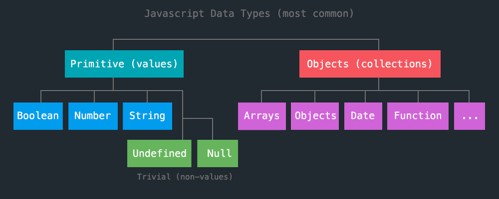

<!-- paginate: true -->

← [Learn Javascript](../../)

<a href="../../"></a>

# Data Structures

How to use arrays, objects, and loops

<span class="slides-small"><a href="slides.html">slides</a> | <a href="data-structures.md">md</a></span>

<!--
Presentation comments ...
-->


---

## Introduction

Review the following sections and perform the activities on your own or with your group.

Perform the task(s) when you see this 👉  emoji

<details>
<summary>Learning Objectives</summary>

Students who complete this module will be able to:

- Demonstrate
- Explain
- Create

</details>

<details>
<summary>Homework</summary>

- [Codecademy: JS 5-1 Arrays](https://www.codecademy.com/learn/introduction-to-javascript) (1–7)
- [Codecademy: JS 6-1 Loops](https://www.codecademy.com/learn/introduction-to-javascript) (1–7)

</details>


---

## Data Collections

In addition to <a href="https://developer.mozilla.org/en-US/docs/Glossary/Primitive" target="_blank">primitive data types</a>, Javascript can store collections of data like `arrays`, `objects`, as well as more complex entities.





---

## Arrays

- A Javascript <a href="https://developer.mozilla.org/en-US/docs/Web/JavaScript/Reference/Global_Objects/Array" target="_blank">array</a> is a list of values, separated by commas.
- Arrays are zero-indexed, and their values can be set or retrieved using their index.

```js
let numbers = [-2, -1, 0, 1, 2]; // array of numbers
let colors = ["red", "green", "blue"]; // array of strings
colors[0]; // -> "red"
```


---

## Array Methods

<div class="twocolumn">
<div class="col">

- Like other Javascript types, the console can list properties and methods specific to arrays.

👉 **Try it out** - Run these in the console

```js
// the array constructor
[]

// e.g. length
["abc", 123].length // -> 2

// arrays are technically objects
typeof([]) // -> 'object'

// create this array
let colors = ["red", "green", "blue"];
colors.length // -> 3
colors.slice(1,3) // -> ["green", "blue"]
```

</div>
<div class="col">


</div>
</div>


---

## Multi-Dimensional Arrays

- Javascript allows different data types to be stored in arrays (e.g. `["abc", 123]`), including other arrays, objects, and complex types.

```js
// an array of arrays
const table = [
	['name', 'age', 'favoriteColor'],
	['Mary', 18, 'mauve'],
	['Chalet', 81, 'chartreuse']
];
table[1][2] // -> 'mauve'

// array of date objects
const dates = [
	new Date(Date.UTC(1989, 10, 9, 17, 53, 0)), // UTC
	new Date("9 November 1989 18:53 UTC+1"), // BERLIN
	new Date("November 9, 1989 12:53 UTC-5") // NYC
];
dates[1].toUTCString() // -> "Thu, 09 Nov 1989 17:53:00 GMT" (Berlin local time)
```


---

## Objects

- Javascript <a href="https://developer.mozilla.org/en-US/docs/Web/JavaScript/Reference/Global_Objects/Object" target="_blank">objects</a> store `key:value` relationships where `key` is a string, and `value` can be any type.
- You can get or set object values using the key and dot notation.

```js
const color = {
	"name": "red",
	"hex": "#ff0000",
	"rgb": [255,0,0]
}
console.log(color.name); // -> "red" via dot notation
console.log(color['name']); // -> "red" via square brackets
```

<div class="caption slides-small">
	You can also use square brackets to fetch the value, particularly if there is a special character or space in the key name.
</div>


---

## Objects

- Objects can store methods


```js
const ev = {
	name: "Fall of the Berlin Wall",
	link: "https://en.wikipedia.org/wiki/Fall_of_the_Berlin_Wall",
	date: new Date(Date.UTC(1989, 10, 9, 17, 53, 0)),
	timeZone: "CET",
	getLocalTimeStr: function(){
		return this.date.toLocaleString('de-DE', {timeZone: this.timeZone})
	}
};
console.log(`${ev.name}, ${ev.date.getUTCFullYear()}`); // -> "Fall of the Berlin Wall, 1989"
console.log(ev.getLocalTimeStr()); // -> "9.11.1989, 18:53:00"
```


---


```js
// a new array
let myArray = [10,34,101];
// use the push() method to add a new value
myArray.push(521);
// get the length property
console.log(myArray.length);
// -> 4
// a new object
let myObject = {
	color1: "blue",
	color2: "gold"
};
```


---

## Loops

- One of the biggest benefits to working with arrays is that you can loop through them


---

## Encapsulation

- Objects are handy because they <a href="https://en.wikipedia.org/wiki/Encapsulation_(computer_programming)" target="_blank">encapsulate</a> data, grouping like information inside a single container, and standardizing access.

```js

var people = [
	{ name: "Joel", age: 99 },
	{ name: "John", age: 66 },
	{ name: "Jack", age: 33 }
];
people.forEach(function(item, index){
	console.log(`${item.name} is ${item.age} years old`);
});
// -> Joel is 99 years old
// -> John is 66 years old
// -> Jack is 33 years old
```


---


## Next steps

1. Try the [Exercises](#exercises) below.
1. Start working on homework listed in the schedule.
1. Continue to the next lesson: **Data Structures** [slides](../jquery/slides.html) | [md](../jquery/jquery.md)


---

## Exercises

👉 **Try it out**

1. [Lottery v.1](../../topics/games/the-lottery/README.md) - Build your first game!
1. [Gradebook](../../topics/single-page-apps/grade-book/README.md) - Code a gradebook app using conditions, functions, and jquery.
1. Exercises from Eloquent Javascript Ch2 [Looping a triangle](https://eloquentjavascript.net/02_program_structure.html#h_TcUD2vzyMe), [FizzBuzz](https://eloquentjavascript.net/02_program_structure.html#h_TcUD2vzyMe), [Chessboard](https://eloquentjavascript.net/02_program_structure.html#h_TcUD2vzyMe)


- Exercises: CH4 [The sum of a range](https://eloquentjavascript.net/04_data.html#i_8ZspxiCEC/), [Reversing an array](https://eloquentjavascript.net/04_data.html#i_6xTmjj4Rf5), [A list](https://eloquentjavascript.net/04_data.html#i_nSTX34CM1M), [Deep comparison](https://eloquentjavascript.net/04_data.html#i_IJBU+aXOIC)


---

## References

- Haverbeke: [Ch4 Data Structures: Objects and Arrays](https://eloquentjavascript.net/04_data.html) (57-79)
- Codecademy Cheatsheet(s) [arrays](reference-sheets/js-05-arrays.pdf), [loops](reference-sheets/js-06-loops.pdf)
- w3schools [arrays](https://www.w3schools.com/js/js_arrays.asp), [objects](https://www.w3schools.com/js/js_objects.asp), [json](https://www.w3schools.com/js/js_json_intro.asp), [json syntax](https://www.w3schools.com/js/js_json_syntax.asp), [methods](https://www.w3schools.com/js/js_htmldom_methods.asp), [for loop](https://www.w3schools.com/js/js_loop_for.asp), [break](https://www.w3schools.com/js/js_break.asp)
