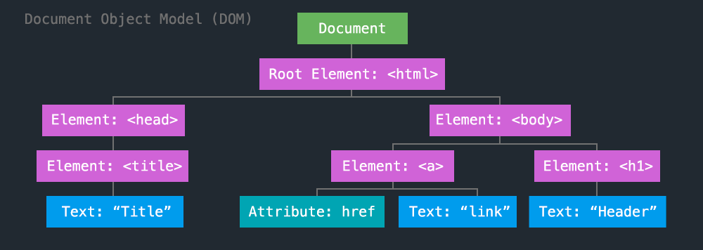
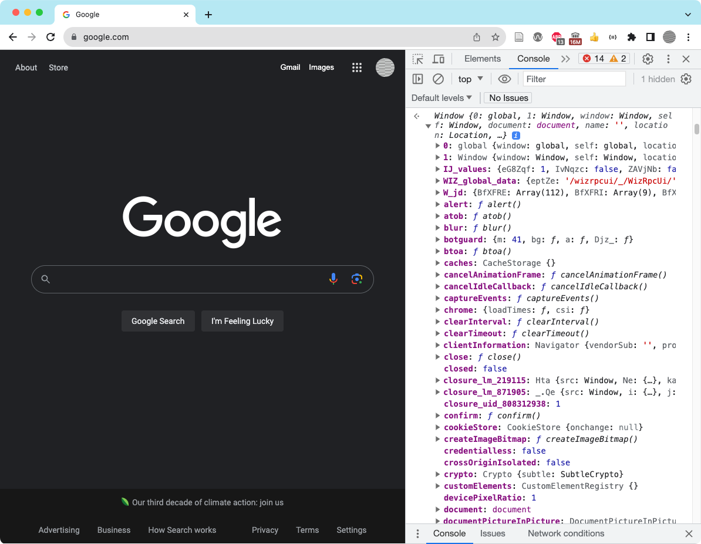

<!-- paginate: true -->

← [Learn Javascript](../../)

<a href="../../"></a>

# Document Object Model (DOM)

Working with the dom

<span class="slides-small"><a href="slides.html">slides</a> | <a href="dom.md">md</a></span>

<!--
Presentation comments ...
-->


---

## Contents

1. [Introduction](#introduction)
1. [Selecting HTML elements](#selecting-html-elements) `5 min`
1. [Next steps](#next-steps)
1. [Exercises](#exercises)
1. [References](#references)


---

## Introduction

Review the following sections and perform the activities on your own or with your group.

Perform the task(s) when you see this 👉  emoji

<details>
<summary>Learning Objectives</summary>

Students who complete this module will be able to:

- Demonstrate how to
- Explain
- Use Javascript to
- List

</details>

<details>
<summary>Homework</summary>

- [Haverbeke Ch13 JavaScript and the Browser](https://eloquentjavascript.net/13_browser.html) (216-222)
- [Haverbeke Ch14 The Document Object Model](https://eloquentjavascript.net/14_dom.html) (224-241)
- [Haverbeke Ch15 Handling Events](https://eloquentjavascript.net/15_event.html) (243-259)
- [Haverbeke Ch18 HTTP and Forms](https://eloquentjavascript.net/18_http.html) (308-328)

</details>


---

## About the DOM

- Every time a web page loads, a new DOM object is created.
- The DOM provides properties and methods for the page, as well as the potential to access (or change) all its HTML and CSS.




---

## The window object

👉 View these properties and functions in the console (or access them with javascript using dot syntax).

<div class="twocolumn">
<div class="col">

1. Type `window` and press return
1. Expand a property *`{}`* or function *`f`* to see more. 
1. Functions can be called in the console: `alert(123)` or `window.alert(123)` and press return.

</div>
<div class="col">



</div>
</div>


---

## The document object


<div class="twocolumn">
<div class="col">

- The `window` refers to the page and browser tab
- While `window.document` (or just `document`) references the page structure, content, and properties for the page only. 
- 👉 Explore these in the console

</div>
<div class="col">


```js
// get web page url property
window.document.URL
// get background color property
window.document.bgColor
// change the bgColor property
window.document.bgColor = "red"
```

</div>
</div>


---

## Selecting HTML elements

Many properties can be access with "vanilla" Javascript

```js
// get the current URL
window.alert(document.URL);
// replace the content of the body
window.document.body.innerHTML = "😃"
// return an array of all <a> elements on the page: 
window.document.querySelectorAll("a")
// set a new location for this window: 
window.document.location = "https://davidson.edu"
```


---

## Selecting HTML elements

<div class="twocolumn1x2">
<div class="col">

- There are several methods to select an element in the DOM.
- <a href="https://developer.mozilla.org/en-US/docs/Web/API/Document/querySelector" target="_blank">document.querySelector()</a> returns the first element that matches the specified selector.

</div>
<div class="col">

```html
<p id="greeting">Hello world</p>
```

```js
// use #id to store reference to element
let ele = document.querySelector("#greeting");
// get the text
console.log(ele.textContent);
// or set the text
ele.textContent = "Hello world!";
```

</div>
</div>


---

## Forms and Events

- Add a `submit` listener to process each `input` in a web form. 
- Use <a href="https://developer.mozilla.org/en-US/docs/Web/API/Event/preventDefault" target="_blank">`preventDefault`</a> to prevent the form from loadinga new page. 


```html
<form action="#">
  <input type="text" id="color">
  <input type="submit">
</form>
```

```js
document.addEventListener("submit", function(e) {
	e.preventDefault();
	let colorVal = document.getElementById("color").value;
	console.log(colorVal);
	document.body.bgColor = colorVal;
})
```


---

## jQuery and The DOM

jQuery is a Javascript library you will see often in code references. It provides easy access to properties and methods in the HTML DOM, but it is better to learn "pure JS".

NOTE: <a href="https://youmightnotneedjquery.com)" target="_blank">youmightnotneedjquery.com</a>


```js
// select all divs, set backgrounds red
$('div').css({ 'background': 'red' });
// select all elements with myClass, add text to end
$('.myClass').append(' - here is some new text');
```


---

## Forms and Events with jQuery

**Overview**: Events and using forms with Javascript and jQuery

NOTE: <a href="https://youmightnotneedjquery.com)" target="_blank">youmightnotneedjquery.com</a>

```js
// click event with callback
$('#submitButton').click(function() {
	// set the value of a form element
	$('#color').val("purple");
	// do not perform the default form action
	return false;
});
```


---

## Next steps

1. Try the [Exercises](#exercises) below.
1. Start working on homework listed in the schedule.
1. Continue to the [next lesson](../../).


---

## Exercises

👉 **Try it out**

1. [The Lottery v.2](demos/games/the-lottery/) - responding to events, [The Lottery v.3](demos/games/the-lottery/) - displaying content in the browser
	- Already finished? Add a way to spend more money in the lottery game
1. Exercises from Eloquent Javascript
	- Exercises: Ch14 [Build a table](https://eloquentjavascript.net/14_dom.html#h_TcUD2vzyMe), [Elements by tag name](https://eloquentjavascript.net/14_dom.html#i_VSftnyRTsV), [The cat’s hat](https://eloquentjavascript.net/14_dom.html#i_b/LAqZUqyo)
	- Ch15 [Balloon](https://eloquentjavascript.net/15_event.html#i_ZPJB9UFdQA), [Mouse trail](https://eloquentjavascript.net/15_event.html#i_NOgRH0Y9st), [Tabs](https://eloquentjavascript.net/15_event.html#i_Kk1WKx2anJ)
	- Ch18 [Content negotiation](https://eloquentjavascript.net/18_http.html#i_uaWwL8WGXf), [A JavaScript workbench](https://eloquentjavascript.net/18_http.html#i_wTXvIH5Wds), [Conway’s Game of Life](https://eloquentjavascript.net/18_http.html#i_XyKQVmCbTN)


---

## References

- Haverbeke [Ch2 Program Structure](https://eloquentjavascript.net/02_program_structure.html) (22-26)
- Codecademy Cheatsheet(s) [Conditionals](../../reference-sheets/js-02-conditionals.pdf)
- Codecademy Cheatsheet(s) [jquery introduction](reference-sheets/jquery-01-introduction.pdf), [effects](reference-sheets/jquery-02-effects.pdf), [jquery events](reference-sheets/jquery-03-events.pdf), [style methods](reference-sheets/jquery-04-style-methods.pdf), [dom traversing](reference-sheets/jquery-05-dom-traversing.pdf)
- w3schools [DOM](https://www.w3schools.com/js/js_htmldom.asp), [HTML DOM](https://www.w3schools.com/js/js_htmldom_html.asp), [jQuery intro](https://www.w3schools.com/jquery/jquery_intro.asp), [Get Started](https://www.w3schools.com/jquery/jquery_get_started.asp), [syntax](https://www.w3schools.com/jquery/jquery_syntax.asp), [selectors](https://www.w3schools.com/jquery/jquery_selectors.asp), [event methods](https://www.w3schools.com/jquery/jquery_events.asp)
- w3schools [Javascript practice](https://www.w3schools.com/js/exercise_js.asp)
