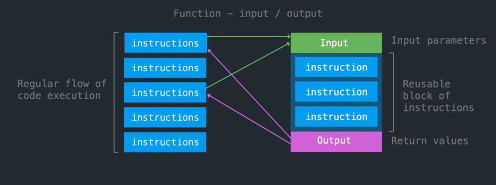

<!-- paginate: true -->

← [Learn Javascript](../../)

<a href="../../"></a>

# Functions

How to reuse code, protect variables, and organize code

<span class="slides-small"><a href="slides.html">slides</a> | <a href="functions.md">md</a></span>

<!--
Presentation comments ...
-->


---

## Introduction

Review the following sections and perform the activities on your own or with your group.

Perform the task(s) when you see this 👉  emoji

<details>
<summary>Learning Objectives</summary>

Students who complete this module will be able to:

- Explain the benefits of using functions
- Compare global and local scope
- Create a function and call it from javascript code

</details>

<details>
<summary>Homework</summary>

- [Codecademy: JS 3-1 Functions](https://www.codecademy.com/learn/introduction-to-javascript) (1-7)
- [Codecademy: JS 4-1 Scope](https://www.codecademy.com/learn/introduction-to-javascript) (1-4)

</details>


---

## About Functions

<div class="twocolumn">
<div class="col">

- Functions let you reuse blocks of code.
- Functions are also called "methods", especially in OOP (Object Oriented Programming).

</div>
<div class="col">

```js
// some built-in functions
alert("hello world!");
console.log(123);
Math.ceil(1.3); // -> 2
```

```js
// a custom function
function coolNewFunction(){
	// this code runs each
	// time you call the function
}
coolNewFunction();
```

</div>
</div>


---

## Anatomy of a Function

- Functions can be customized using **parameters** to change their **return values**.


<div class="caption slides-small"></div>


---

## Code reuse

- The <a href="https://en.wikipedia.org/wiki/Don%27t_repeat_yourself" target="_blank">D.R.Y.</a> principle says that reusing code makes it easier to write and manage.



<div class="caption slides-small">Flow of a typical program</div>


---

## Code reuse

This is the code from the previous lesson. This code runs just once.

```js
let apples = 2;

if (apples > 3) {
	console.log(`We have ${apples} apples! We can make pie!`)
} else {
	console.log(`We have ${apples} apples! We need more apples`)
}
// -> "We have 2 apples! We need more fruit."
```


---

## Code reuse

<div class="twocolumn">
<div class="col">

Wrapping this code inside a function lets us...

1. Run the code multiple times with different values
1. Change the value that determines the logical flow

</div>
<div class="col">


```js
function canPie(fruit, count){
    let str = `We have ${count} ${fruit}! `;
    if (count > 3) {
        str += `We can make pie!`;
    } else {
        str += `We need more fruit.`;
    }
    return str;
}

console.log(`${canPie("apples", 2)}`);
// -> "We have 2 apples! We need more fruit."

console.log(`${canPie("pears", 5)}`);
// -> "We have 5 pears! We can make pie!"

console.log(`${canPie("berries", 101)}`);
// -> "We have 101 berries! We can make pie!"
```

</div>
</div>


---

## Scope

Where you declare a variable determines its **scope**, or how it can be accessed by other parts of your program

- **Global Scope** - Variables can be accessed anywhere in your program
- **Local Scope** - Variables are accessible only within their statement block


---

## Scope

```js
// ✅ global variables can be accessed anywhere
let foo = "hello";
if (true) {
	foo = "goodbye";
}
console.log("foo =", foo); // -> "goodbye"

// ❌ this will fail because it was defined (scoped) in a block
if (true){
	let bar = 123; // a local variable
}
console.log("bar =", bar);
// -> "Uncaught ReferenceError: bar is not defined"
```
<div class="slides-small">
	<a href="demos/functions-scope.html" target="_blank">demos/functions-scope.html</a>
</div>


---

## Function Expressions

- Previously we used the [function declaration](https://developer.mozilla.org/en-US/docs/Web/JavaScript/Reference/Functions) to define a function.
- Also common is the [function expression](https://developer.mozilla.org/en-US/docs/Web/JavaScript/Reference/Operators/function), here using the ["fat arrow"](https://developer.mozilla.org/en-US/docs/Web/JavaScript/Reference/Functions/Arrow_functions) syntax

```js
const isPizzaTime = () => {
	let today = new Date();
	if (today.getHours() > 10 && today.getHours() < 24){
		return "yes, it is";
	} else {
		return "I'm afraid not";
	}
}
console.log(isPizzaTime());
```


---

## Anonymous Functions


<div class="twocolumn">
<div class="col">

- **Anonymous functions** are function expressions that are not assigned to a name.
- Often used as callbacks from jquery and other event listeners.
- Right, callbacks can be stored as function expressions or plain anonymous functions

</div>
<div class="col">

```js
$("form").submit(function() {
	// the code in this function
	// is used as a callback from
	// the submit listener
});
```

```js
$("form").submit(myCallback);

var myCallback = function() {
	// this is the same
}
```

</div>
</div>


---

## Anonymous Functions


<div class="twocolumn">
<div class="col">

- Variables declared in anonymous functions won't conflict with other code used in your project.
- An IIFE [(Immediately Invoked Function Expressions)](https://developer.mozilla.org/en-US/docs/Glossary/IIFE) will run as soon as your code runs and helps to [limit global variables](https://developer.mozilla.org/en-US/docs/Glossary/IIFE#avoid_polluting_the_global_namespace) and conflicts.

</div>
<div class="col">

```js
(function(){
	// an IIFE runs immediately but
	// the variables declared here
	// do not have global scope
})();
```

</div>
</div>


---

## Next steps

1. Try the [Exercises](#exercises) below.
1. Start working on homework listed in the schedule.
1. Continue to the next lesson: **Data Structures** [slides](../data-structures/slides.html) | [md](../data-structures/data-structures.md)


---

## Exercises

👉 **Try it out**

1. [Lottery v.2](../../topics/games/the-lottery/README.md) - Show results of the game in HTML
1. [Gradebook](../../topics/single-page-apps/grade-book/README.md) - Code a gradebook app using conditions, functions, and jquery.
1. Revisit [this lamp demo](../../topics/single-page-apps/javascript-lamp/index.html) to explore how it uses functions


---

## References

- Haverbeke [Ch3 Functions](https://eloquentjavascript.net/03_functions.html) (39-55)
- Codecademy Cheatsheet(s) [functions](reference-sheets/js-03-functions.pdf), [scope](reference-sheets/js-04-scope.pdf)
- w3schools [functions](https://www.w3schools.com/js/js_functions.asp), [arrow functions](https://www.w3schools.com/js/js_arrow_function.asp)
- [JavaScript Functions vs Methods (and other helpful tips)](https://medium.com/predict/javascript-functions-vs-methods-and-other-helpful-tips-e58a621b1d27)


---

## Advanced Function Concepts

Continue for more concepts.


---

## Side Effects

- [**Side effects**](https://en.wikipedia.org/wiki/Side_effect_(computer_science)) are statements that evaluate an expression and produce some other effect instead of returning a value.

```js
alert(1 + 1); // -> Opens a popup window
console.log(1 < 2); // -> logs to the console
```

<div class="caption slides-small">
	<a href="https://medium.com/javascript-scene/master-the-javascript-interview-what-is-functional-programming-7f218c68b3a0" target="_blank">What is Functional Programming?</a>
</div>
