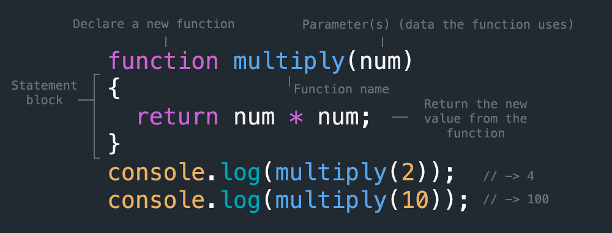

<!-- paginate: true -->

← [Learn Javascript](../../)

<a href="../../"></a>

# Functions

How to reuse code, protect variables, and organize code

<span class="slides-small"><a href="slides.html">slides</a> | <a href="functions.md">md</a></span>

<!--
Presentation comments ...
-->


---

## Introduction

Review the following sections and perform the activities on your own or with your group.

Perform the task(s) when you see this 👉  emoji

<details>
<summary>Learning Objectives</summary>

Students who complete this module will be able to:

- Explain the benefits of using functions
- Compare global and local scope
- Create a function and call it from javascript code

</details>

<details>
<summary>Homework</summary>

- [Codecademy: JS 3-1 Functions](https://www.codecademy.com/learn/introduction-to-javascript) (1-7)
- [Codecademy: JS 4-1 Scope](https://www.codecademy.com/learn/introduction-to-javascript) (1-4)

</details>


---

## About Functions

<div class="twocolumn">
<div class="col">

- In programming, functions are a way to organize and reuse blocks of code.
- Javascript contains several built-in functions that make it easy to perform common tasks.* 
- To use a function, "call" it with the name and two parentheses `()`

<div class="caption slides-small">
*Functions are also called "methods", especially in OOP (Object Oriented Programming).
</div>

</div>
<div class="col">

```js
// these built-in functions
alert("hello world!");

// all require parameters
console.log(123); // -> 123

// to do things 
Math.ceil(1.3); // -> 2
```

<div class="caption slides-small">
The task a function performs can be customized using one or more parameters placed between the parentheses.
</div>

</div>
</div>


---

## Anatomy of a Function

Use the **function** keyword to write custom functions, one or more **parameters** to customize its task, and **return** to send data back to the location where it was called.



<div class="caption slides-small"></div>


---

## Code Reuse

Writing the same code over and over is not only inefficient and boring, it also makes it difficult to detect and fix errors. 

```js
let hexChars = "0123456789abcdef"
document.body.backgroundColor = "#" + 
    hexChars[Math.floor(Math.random() * hexChars.length)] + 
    hexChars[Math.floor(Math.random() * hexChars.length)] +
    hexChars[Math.floor(Math.random() * hexChars.length)] +
    hexChars[Math.floor(Math.random() * hexChars.length)] +
    hexChars[Math.floor(Math.random() * hexChars.length)] +
    hexChars[Math.floor(Math.random() * hexChars.length)]
```

<div class="caption slides-small">
Several lines of code in this example perform the same task. Copy and paste this code into the console to see what it does!
</div>


---

## Custom Functions

If you find yourself typing the same instructions, consider using a **custom function** to make it easier to write and manage the code. 
 

```js
let hexChars = "0123456789abcdef"
function hexChar(){
	return hexChars[Math.floor(Math.random() * hexChars.length)]
}
document.body.backgroundColor = "#" + hexChar() + hexChar() + 
    hexChar() + hexChar() + hexChar() + hexChar();
```

<div class="caption slides-small">
In the updated example the repeated code is "wrapped" with a function which "returns" the value of the expression back to the location where it was called. The changes reflect the <a href="https://en.wikipedia.org/wiki/Don%27t_repeat_yourself" target="_blank">D.R.Y.</a> ("Don't Repeat Yourself") principle in action.
</div>

 


<!-- 

---

## Code reuse

This is the code from the previous lesson. This code runs just once.

```js
let apples = 2;

if (apples > 3) {
	console.log(`We have ${apples} apples! We can make pie!`)
} else {
	console.log(`We have ${apples} apples! We need more apples`)
}
// -> "We have 2 apples! We need more fruit."
```


---

## Code reuse

<div class="twocolumn">
<div class="col">

Wrapping this code inside a function lets us...

1. Run the code multiple times with different values
1. Change the value that determines the logical flow

</div>
<div class="col">


```js
function canPie(fruit, count){
    let str = `We have ${count} ${fruit}! `;
    if (count > 3) {
        str += `We can make pie!`;
    } else {
        str += `We need more fruit.`;
    }
    return str;
}

console.log(`${canPie("apples", 2)}`);
// -> "We have 2 apples! We need more fruit."

console.log(`${canPie("pears", 5)}`);
// -> "We have 5 pears! We can make pie!"

console.log(`${canPie("berries", 101)}`);
// -> "We have 101 berries! We can make pie!"
```

</div>
</div>
 -->


---

## Global Scope

The location in your code where you declare a variable determines its **scope**, or how it can be accessed by other parts of your program. With **global scope**, variables can be accessed from anywhere.

```js
let foo = "hello";
function updateFoo() {
	foo = "goodbye"; // ✅ we can access a global variable
}
updateFoo();
console.log("foo =", foo); // -> "goodbye"
```

<div class="slides-small">
	Example: <a href="demos/functions-scope.html" target="_blank">demos/functions-scope.html</a>
</div>


---

## Local Scope

Alternately, with **local scope**, variables are accessible only within the statement block (and nested blocks) where they were declared.

```js
function updateBar() {
	let bar = 123; // variable declared with local scope
}
updateBar();
// ❌ bar is local because was defined (scoped) in a block
console.log("bar =", bar);
// -> "Uncaught ReferenceError: bar is not defined"
```

<div class="slides-small">
	Example: <a href="demos/functions-scope.html" target="_blank">demos/functions-scope.html</a>
</div>


---

## Function Expressions

We have only used the [function declaration](https://developer.mozilla.org/en-US/docs/Web/JavaScript/Reference/Functions) to define functions so far, but another common method is with the [function expression](https://developer.mozilla.org/en-US/docs/Web/JavaScript/Reference/Operators/function). 

```js
const getCurrentHour = () => {
    let today = new Date();
    return today.getHours();  
}
console.log(getCurrentHour());
```

Here we use the ["fat arrow"](https://developer.mozilla.org/en-US/docs/Web/JavaScript/Reference/Functions/Arrow_functions) syntax, since the function body can be shortened to a single line;

```js
const getCurrentHour = () => new Date().getHours(); 
console.log(getCurrentHour());
```


<div class="slides-small">
	<a href="https://codepen.io/owenmundy/pen/RwYzMEp?editors=1011" target="_blank">rollTheDice() function expression example</a>
</div>


---

## Anonymous Functions


<div class="twocolumn">
<div class="col">

- **Anonymous functions** are function expressions that are not assigned to a name.
- Often used as callbacks from jquery and other event listeners.
- Callbacks can be stored as function expressions or plain anonymous functions

</div>
<div class="col">

```js
let button = document.querySelector(".btn");

// #1
button.addEventListener("click", function() {
	// anoymous function is handler / callback
});

// #2 
button.addEventListener("click", myCallback);
// callback stored in named function
var myCallback = function() {
	// same as above
}
```

<div class="slides-small">
	These examples do the same thing.
</div>

</div>
</div>


---

## Anonymous Functions (jQuery example)


<div class="twocolumn">
<div class="col">

```js
$("button").click(function() {
	// jquery click() adds listener
    // anonymouse function used as handler
});
```

</div>
<div class="col">


```js
$("button").click(myCallback);

var myCallback = function() {
	// this is the same as the pure JS example
}
```

</div>
</div>


---

## Next steps

1. Explore [More Concepts](#more-concepts) at the end
1. Try the [Exercises](#exercises) below.
1. Start working on homework listed in the schedule.
1. Continue to the next lesson: **Data Structures** [slides](../data-structures/slides.html) | [md](../data-structures/data-structures.md)


---

## Exercises

👉 **Try it out**

1. [Lottery v.2](https://omundy.github.io/learn-javascript/topics/games/the-lottery/) - Show results of the game in HTML
1. [Gradebook](../../topics/single-page-apps/grade-book/README.md) - Code a gradebook app using conditions, functions, and jquery.
1. Revisit [this lamp demo](../../topics/single-page-apps/javascript-lamp/index.html) to explore how it uses functions


---

## References

- Haverbeke [Ch3 Functions](https://eloquentjavascript.net/03_functions.html) (39-55)
- Codecademy Cheatsheet(s) [functions](reference-sheets/js-03-functions.pdf), [scope](reference-sheets/js-04-scope.pdf)
- w3schools [functions](https://www.w3schools.com/js/js_functions.asp), [arrow functions](https://www.w3schools.com/js/js_arrow_function.asp)
- [JavaScript Functions vs Methods (and other helpful tips)](https://medium.com/predict/javascript-functions-vs-methods-and-other-helpful-tips-e58a621b1d27)


---

## More Concepts

Continue for more related concepts.


---

## IIFE


<div class="twocolumn">
<div class="col">

- Variables declared in anonymous functions won't conflict with other code used in your project.
- An IIFE [(Immediately Invoked Function Expressions)](https://developer.mozilla.org/en-US/docs/Glossary/IIFE) will run as soon as your code runs and helps to [limit global variables](https://developer.mozilla.org/en-US/docs/Glossary/IIFE#avoid_polluting_the_global_namespace) and conflicts.

</div>
<div class="col">

```js
(function(){
	// an IIFE runs immediately but
	// the variables declared here
	// do not have global scope
})();
```

</div>
</div>


---

## Side Effects

- [**Side effects**](https://en.wikipedia.org/wiki/Side_effect_(computer_science)) are statements that evaluate an expression and produce some other effect instead of returning a value.

```js
alert(1 + 1); // -> Opens a popup window
console.log(1 < 2); // -> logs to the console
```

<div class="caption slides-small">
	<a href="https://medium.com/javascript-scene/master-the-javascript-interview-what-is-functional-programming-7f218c68b3a0" target="_blank">What is Functional Programming?</a>
</div>
