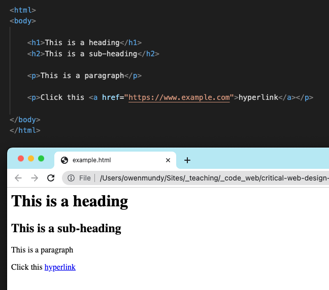
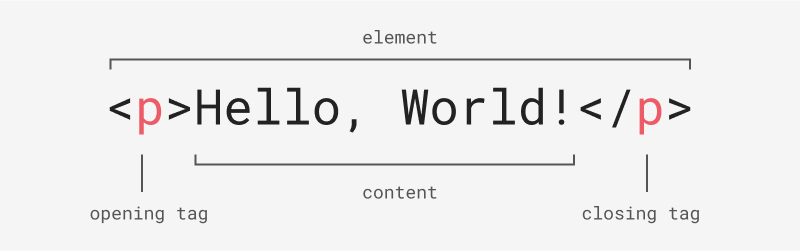
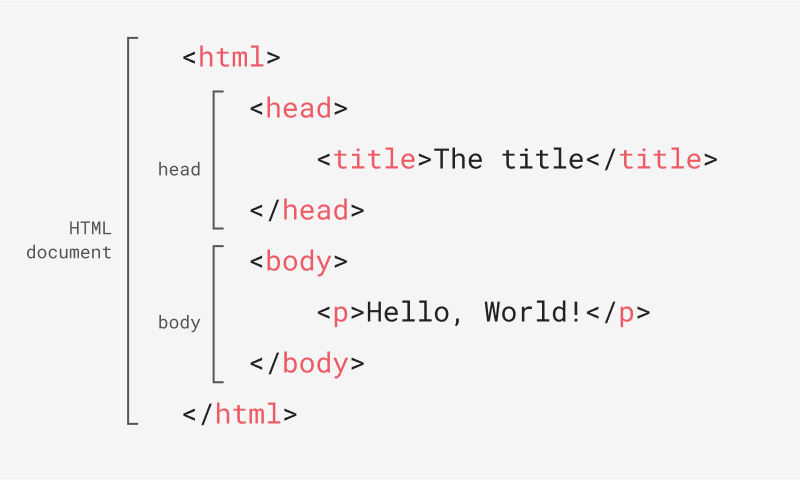
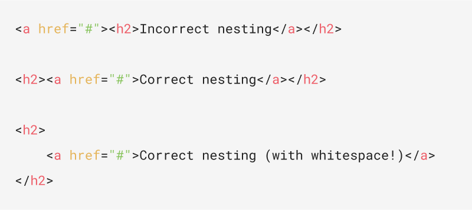
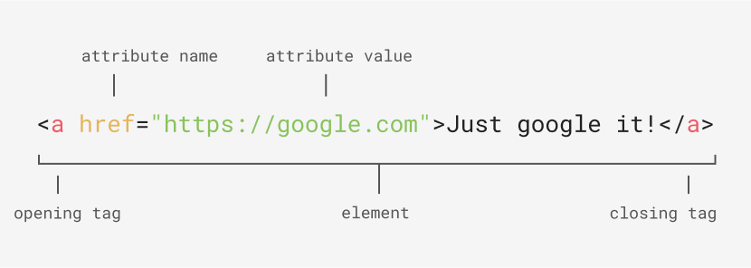

<!-- paginate: true -->

← [Learn Javascript](../../)

 

# HTML + CSS

Introducing HTML and CSS

<a href="slides.html">slides</a> | <a href="dom.md">md</a>

<!-- NOTE - I STARTED THESE AND THEN DECIDED TO JUST DO IT IN GOOGLE SLIDES FRO NOW... -->

<!--
Presentation comments ...
-->

---

## Introduction

Notes

Review the following sections and perform the activities on your own or with your group. Perform the task(s) when you see this 👉  emoji

Learning Objectives

Students who complete this module will be able to:

- Explain the difference between HTML and CSS
- Use HTML and CSS to create a basic web page
- List common HTML elements

Homework

- Critical Web Design [Chapter 1](https://criticalwebdesign.github.io/book/#chapter-1-networks)
- Critical Web Design [Chapter 2](https://criticalwebdesign.github.io/book/#chapter-2-view-source)
- Critical Web Design [Chapter 3](https://criticalwebdesign.github.io/book/#chapter-3-critical-design)
- Critical Web Design [Chapter 4](https://criticalwebdesign.github.io/book/#chapter-4-on-the-grid)

---

# HTML

Module 1.1

1. Markup languages
2. HTML elements, anatomy, attributes
3. Nesting, whitespace 

---

## Markup languages

- Markup languages structure, format, and define text. 
- They are handy for writing plain text documents that look like rich text.
- [Markdown](https://www.markdownguide.org/getting-started/) is one of the simplest, used by Wikipedia and Github README files

    <a href="https://github.com/criticalwebdesign/book/blob/main/01-networks/examples/example.md" target="_blank">Example</a>

---

## 1.1.2 HTML

- HTML (HyperText Markup Language) is the markup language used to structure the content of web pages.
- [Hypertext](https://en.wikipedia.org/wiki/Hypertext) is text displayed with clickable references ([hyperlinks](https://en.wikipedia.org/wiki/Hyperlink)) to other text(s).
- "Vanilla" HTML means no CSS has been applied so you are seeing the default formatting.

    <a href="https://github.com/criticalwebdesign/book/blob/main/01-networks/examples/example.html" target="_blank">Example</a>

---

## HTML Element

- An HTML element includes the opening tag, content contained within, and the closing tag. 
- Tags use predefined names between a less than and greater than sign. 

---

## 👉 Exercise 1.1.1 - Crash Course

Code playgrounds let you test and share HTML, CSS, and Javascript in a “web environment.” 

1. Go to [codepen.io](https://codepen.io) and click “Start Coding” to see the editor.
1. Type `<h1>Hello, World!</h1>` into the HTML section. Codepen will refresh the preview with your updates. 
1. Add some CSS `h1 { color: hotpink; }` to change the presentation of the web page.
2. Use Javascript `alert("Hello, World!")` to control the behavior of web pages.

---

## 1.1.3 HTML Anatomy

- The root element `<html></html>` encloses all other tags
- The `<head>` displays meta content about the page, like the `<title>`. 
- All visible content is placed between the opening `<body>` and closing `</body>` tags.

---
<!-- 1.1.5  -->
## Nested Elements

- Nested elements (elements contained inside other elements) organize content on the page
- Each tag should be closed before you close their parent tag. 
- Improper nesting can cause a browser to fail to render your page correctly. 

 

    <a href="https://github.com/criticalwebdesign/book/blob/main/01-networks/examples/nesting.html" target="_blank">Example</a>

---

## White Space

- Whitespace (spaces, tabs, line breaks, and other hidden characters) can show which elements are children of enclosing parent elements. 
- When a browser renders your page all whitespace is collapsed and shown as  a single space
- Formatting your HTML correctly will avoid nesting errors! 

 

    <a href="https://github.com/criticalwebdesign/book/blob/main/01-networks/examples/nesting.html" target="_blank">Example</a>

---
<!-- 1.1.6 -->
## HTML Attributes

- HTML attributes add information to modify the behavior of tags. 
- For example, an `<a>` tag adds a link, but requires the `href` attribute to provide a destination. The `` tag will display an image file using the `src` attribute. 

 

---

## 👉 Start `hello-world`

1. Fork the [dig245-hello-world](https://github.com/omundy/dig245-hello-world) repository to save a copy under your own Github account
2. Click the green "Code" button and choose "Open with Github Desktop" to save it on your computer.
3. Click Repository > Open in VS Code, to open the project in VS Code 

Open a project in VS Code

- From Github Desktop: Click Repository > Open in VS Code (`Shift + ⌘ + A`)
- From the Finder: Drag a project folder onto the application icon in the dock (Mac)
- From VS Code: File > Open and select the folder

--- 

## Install Live Server

1. In VS Code, click Extensions and search for "Live Server"
2. Install

---

 

# CSS

Module 2.2

1. Markup languages
2. HTML elements, anatomy, attributes
3. Nesting, whitespace 

---

# DevTools

Module 2.3

1. Markup languages
2. HTML elements, anatomy, attributes
3. Nesting, whitespace 

<!-- 

---

## Next steps

1. Try the [Exercises](#exercises) below.
1. Start working on homework listed in the schedule.
1. Continue to the [next lesson](../../).

xxxx

xxxx

 -->
