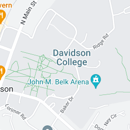
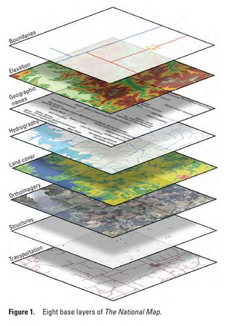
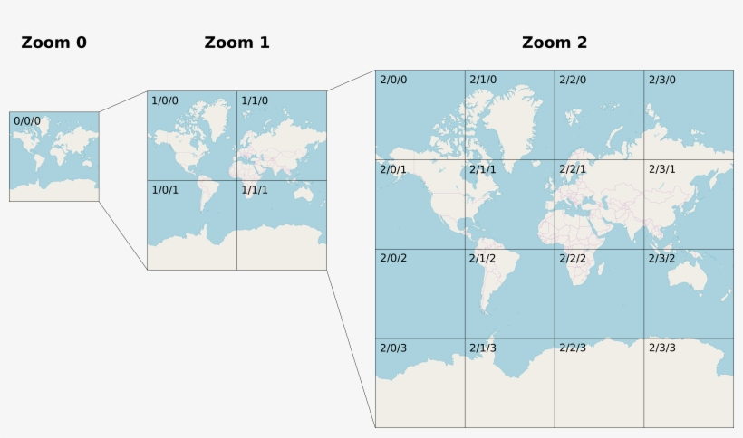

<!-- paginate: true -->

← [Learn Javascript](../../)

<a href="../../"></a>

# Web Maps

Create interactive maps for the web

<span class="slides-small"><a href="../slides/maps.html">slides</a> | <a href="../topics/maps.md">md</a></span>

<!--
Presentation comments ...
-->


---

## About 

 

- Interactive maps on web pages work by loading and displaying images as **map layers** and then providing controls for panning, zooming, etc.
- There are several Javascript frameworks that make it easy to create maps. This demo uses [Leaflet](https://leafletjs.com/), which is free, open source, and mobile friendly.


---

## Map Tiles 

<div class="twocolumn2x1">
<div class="col">

- Imagery in a web map consists of a base layer and overlay layers.
- The base layer is created from a **tileset**, or collection of raster (e.g. satellite photos), or vector images, displayed in a grid.
- Loading maps as tiles is efficient because the browser only needs to request those images needed in the viewport. 
- It also makes it easy to change the base image by simply pointing to a different tileset server. Example servers: [Mapbox](https://www.mapbox.com/gallery), [OSM](https://wiki.openstreetmap.org/wiki/Raster_tile_providers), [leaflet-providers](https://leaflet-extras.github.io/leaflet-providers/preview/) [more](https://leafletjs.com/plugins.html#basemap-providers)  

</div>
<div class="col">



<div class="caption slides-small">
<a href="https://www.usgs.gov/media/images/8-base-layers-national-map" target="_blank">NSGS</a>
</div>

</div>
</div>


---

## Zoom levels


- In addition to location, map tiles correspond to one of 22 specific zoom levels.
- Zoom level `0` shows the full earth, while level `21` shows details of a city. 



<div class="caption slides-small">
This OSM (Open Street Map) tileset url refers to the zoom/x/y
<a href="https://tile.openstreetmap.org/1/0/0.png" target="_blank">https://tile.openstreetmap.org/1/0/0.png</a>
</div>


---

## 👉 Leaflet Quickstart

1. From the <a href="https://leafletjs.com/examples/quick-start/" target="_blank">Leaflet Quickstart</a>, add the CSS, then JS
1. Add a div for the map `<div id="map"></div>`
1. Make sure the map container height is defined `#map { height: 180px; }`
1. In Javascript, initialize the map, add a tileLayer, then continue adding features.

```js
// initialize the map
var map = L.map('map').setView([51.505, -0.09], 13);
// set the tileset
L.tileLayer('https://tile.openstreetmap.org/{z}/{x}/{y}.png', {
    maxZoom: 19,
    attribution: '&copy; OpenStreetMap'
}).addTo(map);
```


---

## Geojson

- <a href="https://geojson.org/" target="_blank">Geojson</a> (supported by <a href="https://leafletjs.com/examples/geojson/" target="_blank">Leaflet</a>) format can store map data and features.
- 👉 Paste the below into the <a href="https://geojson.io/" target="_blank">geojson.io</a> editor to visualize and add data.


```js
// example-vac.geojson
{
    "type": "FeatureCollection",
    "features": [{
        "type": "Feature",
        "properties": {
            "info": "be here now 🤩"
        },
        "geometry": {
            "coordinates": [-80.84841429929385, 35.50168511342781],
            "type": "Point"
        }
    }]
}
```

---

## Geojson + Leaflet

- To add data to a Leaflet map, simply store the geojson data above in a variable, then add it with `L.geoJSON()`. 
- 👉 Continue <a href="https://leafletjs.com/examples/geojson/" target="_blank">Leaflet Geojson tutorial</a>


```js
// store previous page in an object
var geojsonFeature = { 
    "type": "FeatureCollection",
    ... 
}
// add it to the map
L.geoJSON(geojsonFeature).addTo(map);
```


---

## Leaflet Maps

More tutorials

- [Leaflet: Make a web map!](https://maptimeboston.github.io/leaflet-intro/)
- [Web Map Workshop](http://duspviz.mit.edu/web-map-workshop/)


---

## Map Library Comparison

Library | Key | Cost | Description
--- | :---: | :---: | ---
[Leaflet.js](https://leafletjs.com/) |  | free |
[OpenLayers](https://openlayers.org/) |  | free |
[Mapbox GL JS](https://www.mapbox.com/mapbox-gljs) | 🔑 | [50,000](https://www.mapbox.com/pricing) free loads before 💲 | Style maps with [mapbox-studio](https://www.mapbox.com/mapbox-studio)
[Google Maps API](https://developers.google.com/maps/documentation) | 🔑 | free $200 before 💲 | Popular
[ArcGIS JS API](https://developers.arcgis.com/javascript/latest/) | 🔑 | 💲 | Relatively new


---

## Tools

- [jsonlint.com](https://jsonlint.com/) - The JSON validator
- [geojson.io](http://geojson.io/) - The missing GUI for GEOJSON files
- [TopoJSON](https://github.com/topojson/topojson)


---

## Examples

- [Rainbow behind clouds](https://www.instagram.com/p/B4ca3lThEvQ/) (2015), [And its pouring in Korea](https://www.instagram.com/p/CDwHr6nBb5S/) by [Yehwan Song](http://yhsong.com/)
- Jodi [geogoo.net](https://www.youtube.com/watch?v=7GB9Txb5_0E) (link to video, site is gone)
- Brook Singer [Toxic Sites](https://brookesinger.net/Toxic-Sites)
- [I Know Where Your Cat Lives](https://iknowwhereyourcatlives.com/) uses the Google Maps API to display cats by the lat/lng where they were taken.
- [Reducing Uncertainty](https://reducinguncertainty.org/) uses Leaflet to display margin of error in census data.
