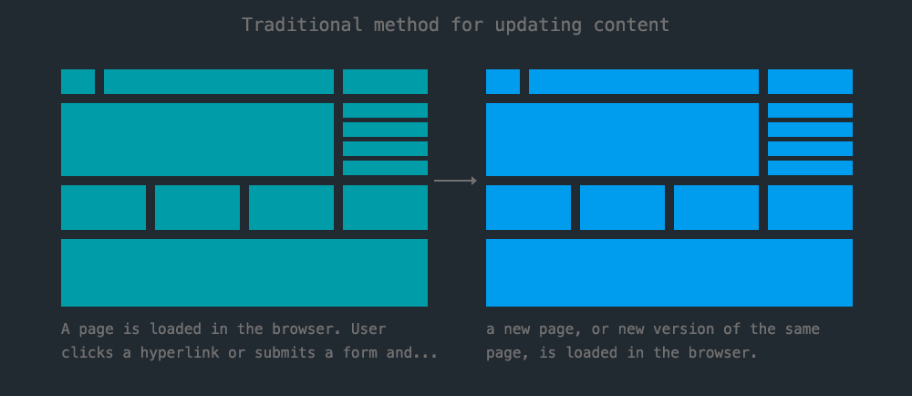
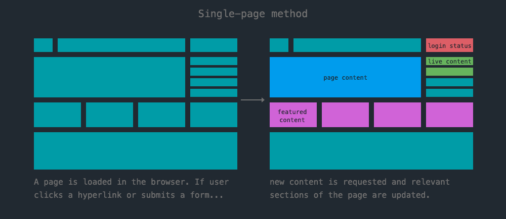
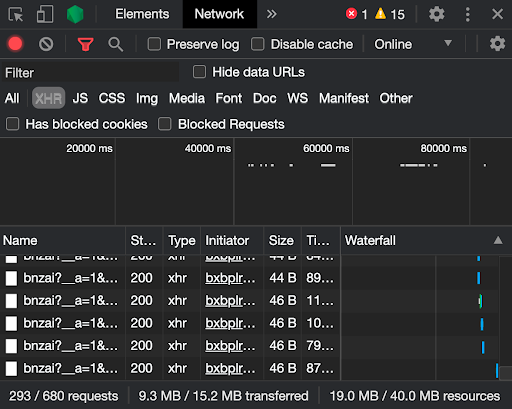

<!-- paginate: true -->

← [Learn Javascript](../../)

<a href="../../"></a>

# Single Page Applications

Using vanilla JS, jquery, Vue.js, or React

<span class="slides-small"><a href="slides.html">slides</a> | <a href="single-page-apps.md">md</a></span>

<!--
Presentation comments ...
-->


---

## Traditional websites

In a traditional approach to loading new content, users click on a hyperlink, leave the current page, and the browser loads an **entirely new page** (including all its resources).




---

## Single Page Applications

A single-page application (SPA) is a web app or website that dynamically rewrites the web page with new data from the server.




---

## Benefits

- The browser doesn’t have to load and re-render a brand new page for each new "view" because data loads asynchronously (in the background) to give users new content **faster**.
- These seamless transitions also make a website feel **more responsive** to input, like a native app.
- A web app with functionality that runs in the client is **easier** to host (you don't need a PHP server for app functions).


---

## Considerations

The main cons with SPAs are related to the fact they load data without changing the URL.

- To let users link directly to internal pages, developers can rewrite the url in the browser.
- If implemented correctly, the back button will also work.
- Search engines can't see content if it doesn't exist on a page. Not so much an issue with "apps"
- Site analytics have to be handled specific to the solution.


---

## 👉 Can you spot an SPA?

See if you can spot an SPA in the wild.

1. Find an example website that might be an SPA.
1. Does the content in the page
	1. change very quickly?
	1. change, yet the browser doesn't show a loading bar or "refresh state"?
1. See the next section for ways to test the site...


---

## 👉 Can you spot an SPA?

<div class="twocolumn">
<div class="col">

To test the example...

1. Open the Network tab in Dev Tools and browse the site.
1. Is content loading in the background through <a href="https://www.w3schools.com/xml/xml_http.asp" target="_blank">asynchronous XHR requests</a>?
1. See if you can identify "the stack" using the console or source code. Try using this tool: <a href="https://builtwith.com/" target="_blank">builtwith.com</a>

<details>
<summary>Solution</summary>

Popular examples: Facebook, Twitter, Gmail, Netflix, Trello, Google Maps, Google Drive

</details>

</div>
<div class="col">



</div>
</div>


---

## Frameworks

There are several frameworks for creating SPAs.

- <a href="https://angular.io/" target="_blank">Angular</a> (developed/used by Google)
- <a href="https://reactjs.org/" target="_blank">React</a> (developed/used by Facebook, Instagram, and WhatsApp)
- <a href="https://vuejs.org/" target="_blank">Vue.js</a> (developed by ex-Google employees)

Popular SPAs like Facebook and Google docs are complex to create and manage. That is why these frameworks are often developed to try to speed up their own projects.

Each of these libraries <a href="https://www.codeinwp.com/blog/angular-vs-vue-vs-react/" target="_blank">have benefits and drawbacks</a>. Angular and React are the most popular, but Vue is the easiest to learn.


---

## Simple SPA - Update specific text

- It is quite easy to tap into the benefits of an SPA with your own, simple solution.
- This [simple SPA](../../topics/single-page-apps/simple-spa/solution/index.html) uses JS objects for content in each page:

```js
var pages = {
    "home": {
        "title": "This is the home page",
        "content": "This is the content of the home page"
    },
    "about": {
        "title": "This is the about page",
        "content": "This is the content of the about page"
    },
    ...
};
```

---

## Simple SPA Chart - Update a section of the page

This [simple SPA chart](../../topics/single-page-apps/simple-spa-chart/solution/index.html) loads html pages for different "views"

```html
<!-- contents of intro.html -->
<h1>Intro</h1>
```

...which are loaded dynamically into `div#main` of index.html.

```js
$("#main").load('views/intro.html');
```

<div>
Note: In order for Javascript to load remote content (most SPAs) it must be running on a web server using the <b>http protocol</b>, like <code>http://</code> or <code>https://</code>. If your url begins with <code>file://</code> then it won't work. See instructions on the next slide to run a server...
</div>


---

## How to start a web server

<div class="twocolumn2x1">
<div class="col">

To test the example...

1. Install Node using the [installer](https://nodejs.org/en/) or [Homebrew](https://formulae.brew.sh/formula/node) (Mac) or [Scoop](https://scoop.sh/) (Windows)
1. Install [serve package](https://www.npmjs.com/package/serve) globally:
	`npm install --global serve`
1. Change to your project directory `cd <directory>` and run `serve` to start the server.
1. Or specify the folder you want to serve:
	`serve <directory>`

</div>
<div class="col">


</div>
</div>


---

## More examples

Other simple examples that manage state / change views:

- [javascript-lamp](../../topics/single-page-apps/javascript-lamp/index.html)
- [games/gnome-dragger](../../topics/games/gnome-dragger/index.html)
- [games/bug-selector](../../topics/games/bug-selector/index.html)
- [quiz-simple](../../topics/single-page-apps/quiz-simple/index.html)


---

## Vue.js

<div class="twocolumn">
<div class="col">

- Vue ("view") is a JS framework that uses a component-based programming model for building user interfaces.
- **Declarative Rendering** Vue extends standard HTML with a template syntax `{{ }}` to describe output from your program.
- **Reactivity** Vue automatically tracks and updates the DOM when your program state changes.

<a href="vue-hello/demo.html" target="_blank">Open the Vue demo</a>

</div>
<div class="col">

```html
<div id="app">
	<h1>{{ title }}</h1>
	<button @click="count++">
		Count is: {{ count }}
	</button>
</div>
<script type="module">
import { createApp } from 'vue'
// create and mount the app
createApp({
	data() {
		return {
			title: "Hello world!",
			count: 0
		}
	}
}).mount('#app')
</script>
```

</div>
</div>


---

## Vue.js Components

- The Vue.js component-based architecture means all content and functionality is stored inside external files, or **components**.
- The application imports components as needed, making them easy to reuse (e.g. a footer across your website is always the same).
- A typical architecture (for a todo application) might look <a href="https://vuejs.org/guide/essentials/application.html#the-root-component" target="_blank">like</a>:

```text
App (root component)
├─ TodoList
│  └─ TodoItem
│     ├─ TodoDeleteButton
│     └─ TodoEditButton
└─ TodoFooter
   ├─ TodoClearButton
   └─ TodoStatistics
```


---

## Vue.js vs. jQuery

1. All JS apps need to change the DOM (to update/insert/remove elements and content)...
	1. Vue.js updates the DOM automatically to reflect the state of variables in the app.
	1. jQuery (and Vanilla Js) manipulate the DOM directly, leaving it up to the programmer to manage and keep the state of the application consistent with the DOM.
1. Don't use them together: If you manipulate the DOM with jQuery then Vue.js won’t be informed that something was changed externally, so can't manage state automatically.


Action | Vue.js | jQuery or Vanilla JS
--- | --- | ---
Selection of elements | Automatic | `$(selector)` (required)
Change the DOM | Automatic "Reactive" | `$(selector).html()` required
Component architecture | [Built-in (default)](https://vuejs.org/guide/essentials/application.html#the-root-component) | Custom code required
Text Interpolation | `{{ }}` [template syntax](https://vuejs.org/guide/essentials/template-syntax.html#text-interpolation) | `"string " + value` required
Update attributes | `:id` [attribute binding](https://vuejs.org/guide/essentials/template-syntax.html#attribute-bindings) | `$(selector).css({...})`


[jQuery vs Vue.js](https://medium.com/nerd-for-tech/jquery-vs-vue-js-aaa69744ebef)


---

## Ways to use Vue.js

Vue.js is quite flexible in how you implement it within a project. These are listed from simple to advanced concepts.

1. Single page  Mixing static content with Vue.js can be done easily.
1. [Single-File Components (SFC)](https://vuejs.org/guide/scaling-up/sfc.html) encapsulate the template (`HTML`), logic (`JS`), and styling (`CSS`) of a Vue component in a single file.
	1. Pros: Co-location and coupling of concerns, component-scoped CSS
	1. Cons: SFCs require a build step
1. [Server-Side Rendering (SSR)](https://vuejs.org/guide/scaling-up/ssr.html) where Vue.js can be used with Node to create strings on the server.
1. [Static Site Generation (SSG)](https://vuejs.org/guide/scaling-up/ssr.html#ssr-vs-ssg) like SSR but can be served as static pages.


---

## React


---

## Next steps

1. Complete the [Vue.js tutorial](https://vuejs.org/tutorial)
1. Start working on homework listed in the schedule.


---

## References

- [The pros and cons of single page applications (SPAs)](https://www.itechart.com/blog/pros-cons-of-single-page-applications/)
