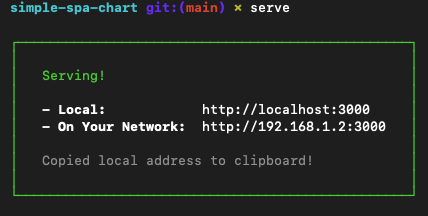

<!-- paginate: true -->

← [Learn Javascript](../../)

<a href="../../"></a>

# Single Page Applications

Using vanilla JS, jquery, Vue.js, or React

<span class="slides-small"><a href="slides.html">slides</a> | <a href="single-page-apps.md">md</a></span>

<!--
Presentation comments ...
-->


--- 

## Traditional websites

In a traditional approach to loading new content, users click on a hyperlink, leave the current page, and the browser loads an **entirely new page** (including all its resources).


---

## Single Page Applications

A single-page application (SPA) is a web app or website that dynamically rewrites the DOM (the entire web page or just selected nodes) with new data from the server.


---

## Benefits

- You can keep track of **state** across multiple pages in your website. For example, variables with answers to a quiz that spans multiple pages. 
- **Hosting** a web app that runs in the client is easier (and cheaper) to host (you don't need a PHP server for app functions).
- Your website is potentially **faster** because the browser doesn’t have to load and re-render a brand new page for each new "view" because data loads asynchronously in the background.
- These seamless transitions also make a website feel **more responsive** to input, like a native app.


---

## Considerations

The main cons with SPAs are related to the fact that they load data without changing the URL:

- To let users link directly to internal pages, developers can rewrite the url in the browser.
- If implemented correctly, the back button will also work.
- Search engines can't see content if it doesn't exist on a page. Not so much an issue with "apps"
- Site analytics have to be handled specific to the solution.


---

## 👉 Can you spot an SPA?

See if you can spot an SPA in the wild.

1. Find an example website that might be an SPA.
1. Does the content in the page...
	1. change very quickly?
	1. change, yet the browser doesn't show a loading bar or "refresh state"?
1. See the next section for ways to test the site...


---

## 👉 Use DevTools to inspect an SPA

<div class="twocolumn">
<div class="col">

To test the example...

1. Open the Network tab in Dev Tools and browse the site.
1. Is content loading in the background through <a href="https://www.w3schools.com/xml/xml_http.asp" target="_blank">asynchronous XHR requests</a>?
1. See if you can identify "the stack" using the console or source code. Try using this tool: <a href="https://builtwith.com/" target="_blank">builtwith.com</a>

<details>
<summary>Solution</summary>

Popular examples: Facebook, Twitter, Gmail, Netflix, Trello, Google Maps, Google Drive

</details>

</div>
<div class="col">


</div>
</div>


---

## Simple SPA - Update specific text

- It is quite easy to tap into the benefits of an SPA with your own, simple solution.
- This [simple SPA](../../topics/single-page-apps/simple-spa/solution/index.html) uses JS objects for content in each page:

```js
var pages = {
    "home": {
        "title": "This is the home page",
        "content": "This is the content of the home page"
    },
    "about": {
        "title": "This is the about page",
        "content": "This is the content of the about page"
    },
    ...
};
```

---

## Simple SPA Chart - Update a section of the page

This [simple SPA chart](../../topics/single-page-apps/simple-spa-chart/solution/index.html) loads html pages for different "views"

```html
<!-- contents of intro.html -->
<h1>Intro</h1>
```

...which are loaded dynamically into `div#main` of index.html.

```js
$("#main").load('views/intro.html');
```

<div>
Note: In order for Javascript to load remote content (most SPAs) it must be running on a web server using the <b>http protocol</b>, like <code>http://</code> or <code>https://</code>. If your url begins with <code>file://</code> then it won't work. See instructions on the next slide to run a server...
</div>


---

## How to start a web server

<div class="twocolumn2x1">
<div class="col">

To test the example...

1. Install Node using the [installer](https://nodejs.org/en/) or [Homebrew](https://formulae.brew.sh/formula/node) (Mac) or [Scoop](https://scoop.sh/) (Windows)
1. Install [serve package](https://www.npmjs.com/package/serve) globally:
	`npm install --global serve`
1. Change to your project directory `cd <directory>` and run `serve` to start the server.
1. Or specify the folder you want to serve:
	`serve <directory>`

</div>
<div class="col">



</div>
</div>


---

## More examples

Other simple examples that manage state / change views:

- [javascript-lamp](../../topics/single-page-apps/javascript-lamp/index.html)
- [games/gnome-dragger](../../topics/games/gnome-dragger/index.html)
- [games/bug-selector](../../topics/games/bug-selector/index.html)
- [quiz-simple](../../topics/single-page-apps/quiz-simple/index.html)


---

## Frameworks

Popular SPAs like Facebook and Google docs are complex to create and manage. Thus, companies have created several frameworks to make their own development more efficient. You can always find [others trending](https://www.google.com/search?q=popular+ui+frameworks), depending on what year it is.

- <a href="https://angular.io/" target="_blank">Angular</a> (developed/used by Google)
- <a href="https://reactjs.org/" target="_blank">React</a> (developed/used by Facebook, Instagram, and WhatsApp)
- <a href="https://vuejs.org/" target="_blank">Vue.js</a> (developed by ex-Google employees)

Each of these libraries <a href="https://www.codeinwp.com/blog/angular-vs-vue-vs-react/" target="_blank">have benefits and drawbacks</a>. Angular and React are the most popular, but Vue is the easiest to learn.


---

## Vue.js

<div class="twocolumn">
<div class="col">

- Vue ("view") is a JS framework that uses a component-based programming model for building user interfaces.
- **Declarative Rendering** Vue extends standard HTML with a template syntax `{{ }}` to describe output from your program.
- **Reactivity** Vue automatically tracks and updates the DOM when your program state changes.

<a href="vue-hello/demo.html" target="_blank">Open the Vue demo</a>

</div>
<div class="col">

```html
<div id="app">
	<h1>{{ title }}</h1>
	<button @click="count++">
		Count is: {{ count }}
	</button>
</div>
<script type="module">
import { createApp } from 'vue'
// create and mount the app
createApp({
	data() {
		return {
			title: "Hello world!",
			count: 0
		}
	}
}).mount('#app')
</script>
```

</div>
</div>


---

## Vue.js Components

- The Vue.js component-based architecture means all content and functionality is stored inside external files, or **components**.
- The application imports components as needed, making them easy to reuse (e.g. a footer across your website is always the same).
- A typical architecture (for a todo application) might look <a href="https://vuejs.org/guide/essentials/application.html#the-root-component" target="_blank">like</a>:

```text
App (root component)
├─ TodoList
│  └─ TodoItem
│     ├─ TodoDeleteButton
│     └─ TodoEditButton
└─ TodoFooter
   ├─ TodoClearButton
   └─ TodoStatistics
```


---

## Vue.js vs. jQuery

All JS apps need to change the DOM (to update/insert/remove elements and content)...

- Vue.js updates the DOM automatically to reflect the state of variables in the app.
- jQuery (and Vanilla Js) manipulate the DOM directly, leaving it up to the programmer to manage and keep the state of the application consistent with the DOM.

Don't use them together: If you manipulate the DOM with jQuery then Vue.js (or React) won’t be informed that something was changed externally, so can't manage state automatically.


---

## Vue.js vs. jQuery

Action | Vue.js | jQuery or Vanilla JS
--- | --- | ---
Selection of elements | Automatic | `$(selector)` (required)
Change the DOM | Automatic "Reactive" | `$(selector).html()` required
Component architecture | [Built-in (default)](https://vuejs.org/guide/essentials/application.html#the-root-component) | Custom code required
Text Interpolation | `{{ }}` [template syntax](https://vuejs.org/guide/essentials/template-syntax.html#text-interpolation) | `"string " + value` required
Update attributes | `:id` [attribute binding](https://vuejs.org/guide/essentials/template-syntax.html#attribute-bindings) | `$(selector).css({...})`

Reference: [jQuery vs Vue.js](https://medium.com/nerd-for-tech/jquery-vs-vue-js-aaa69744ebef)


---

## Ways to use Vue.js

Vue.js is flexible in how you implement it within a project. These are listed from simple to advanced concepts.

1. Single page: Mixing static content with Vue.js can be done easily.
1. [Single-File Components (SFC)](https://vuejs.org/guide/scaling-up/sfc.html) encapsulate the template (`HTML`), logic (`JS`), and styling (`CSS`) of a Vue component in a single file.
	- Pros: Co-location and coupling of concerns, component-scoped CSS
	- Cons: SFCs require a build step
1. [Server-Side Rendering (SSR)](https://vuejs.org/guide/scaling-up/ssr.html) where Vue.js can be used with Node to create strings on the server.
1. [Static Site Generation (SSG)](https://vuejs.org/guide/scaling-up/ssr.html#ssr-vs-ssg) like SSR but can be served as static pages.


---

## React

<div class="twocolumn">
<div class="col">

- React is a JavaScript library for building user interfaces and single-page applications.
- React uses [JSX](https://www.w3schools.com/react/react_jsx.asp) (JavaScript XML), a syntax extension to JavaScript that makes it easier to write and add HTML in React.
- JSX elements are the same as JavaScript expressions. They can be saved in a variable, passed to a function, stored in an object or array.

</div>
<div class="col">

```jsx
// JSX element being saved in a variable...
const navBar = <nav>I am a nav bar</nav>;
// ... or an object
const colors = {
	red: <h1>A sunset</h1>
	green: <h1>Some grass</h1>
	blue: <h1>The sky</h1>
}
```

</div>
</div>


---

## JSX Syntax

- Wrap multi-line JSX expression in parentheses.
- JSX expressions must have exactly one outermost element, even if its a simple `<div></div>`

```jsx
const myDiv = (
  <div>
    <h1>Hello world</h1>
  </div>
);
```

- [JSX gotchas](https://reactjs.org/docs/jsx-in-depth.html)
- [Supported events](https://reactjs.org/docs/events.html#supported-events)


---

## Rendering JSX

In React, for every DOM object, there is a corresponding **[virtual DOM object](https://www.codecademy.com/article/react-virtual-dom)** (see `ReactDOM` in the code example). A virtual DOM object is a representation of a DOM object, like a lightweight copy.


```js
// import libraries
import React from 'react';
import ReactDOM from 'react-dom';
// render to #app
ReactDOM.render(<h1>Hello world</h1>, document.getElementById('app'));
```

<div class="caption slides-small">
	Reference: <a href="https://reactjs.org/docs/introducing-jsx.html" target="_blank">Introducing JSX</a>
</div>


---

## Rendering JSX with a component

This code example is the same as the previous example, but the JSX is stored in a reusable component:

```js
// import libraries
import React from 'react';
import ReactDOM from 'react-dom/client';
// JSX is stored in a reusable component
function HelloComponent(props) {
  return <h1>Hello World!</h1>;
}
// render to #app
const app = ReactDOM.createRoot(document.getElementById("app"));
app.render(<HelloComponent />);
```


---

## React Components

- A React **components** are pieces of reusable UI (user interface) that contain their own markup, appearance, and logic. 
- A component can be as small as a button, or as large as an entire page.
- Traditional website development separates code by technology (HTML, CSS, JS in separate files). React separates code by *concern*—so a component will contain Javascript, HTML (JSX), and CSS inside a single file.  


--- 

## React & CSS

Because React components are "drag and drop" they must contain all the information about appearance. There are several different [ways to write CSS in React](https://css-tricks.com/different-ways-to-write-css-in-react/) including external stylesheets, inline styles `<div className="main" style={{color:"red"}}>`, and (what appears to be the most common) using styles inside objects:

```js
// example component
import { React } from "react";
function App() {
  const styles = {
    main: {
      backgroundColor: "#f1f1f1",
    },
    inputText: {
      color: "red",
    },
  };
  return (
    <div className="main" style={styles.main}>
      <input type="text" style={styles.inputText}></input>
    </div>
  );
}
export default App;
```


---

## React adds complexity

These examples are intended to show the basics, keep in mind that to use React in production:

- You need Node / NPM to run...
- A compiler (e.g. [webpack](https://webpack.js.org/concepts/)) to keep track of dependencies and modules and bundle them into a single Javascript.
- A transpiler (e.g. Babel) to [translate JSX into regular Javascript and make sure newer Javascript (ES6) can run in your browser](https://reactjs.org/blog/2020/09/22/introducing-the-new-jsx-transform.html).

You can set this all up [manually](https://medium.com/age-of-awareness/setup-react-with-webpack-and-babel-5114a14a47e9), or use something like [react-react-app](https://reactjs.org/docs/create-a-new-react-app.html) to generate the project structure.


---

## React and Express

Using React with Express (ES5) requires Babel...

- [Get started with ES6 JavaScript for writing Node.js using Express](https://dev.to/geekygeeky/get-started-with-es6-javascript-for-writing-nodejs-using-express-544h)
- [How to enable ES6 (and beyond) syntax with Node and Express](https://www.freecodecamp.org/news/how-to-enable-es6-and-beyond-syntax-with-node-and-express-68d3e11fe1ab/)


---

## Next steps

1. Complete the [Vue.js tutorial](https://vuejs.org/tutorial)
1. Complete the new [React tutorial](https://beta.reactjs.org/)
1. Start working on homework listed in the schedule.


---

## References

- [The pros and cons of single page applications (SPAs)](https://www.itechart.com/blog/pros-cons-of-single-page-applications/)
