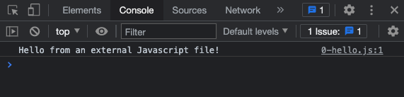
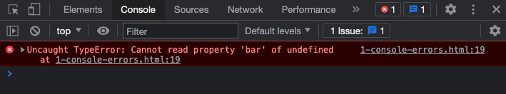
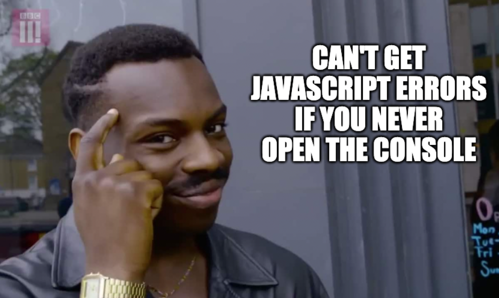
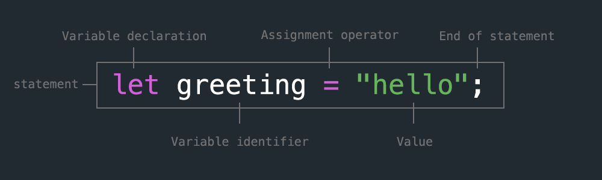

<!-- paginate: true -->

← [Learn Javascript](../../)

<a href="../../"></a>

# Variables

How to store and compare values and data types

<span class="slides-small"><a href="slides.html">slides</a> | <a href="variables.md">md</a></span>


<!--
Presentation comments ...
-->


---

## Contents

1. [Introduction](#introduction)
1. [Add Javascript to a web page](#add-javascript-to-a-web-page) `3 min`
1. [Keep the Console open](##keep-the-console-open) `3 min`
1. [Variables](#variables) `10 min`
1. [Syntax](#syntax) `5 min`
1. [Next steps](#next-steps)
1. [Exercises](#exercises)
1. [References](#references)


---

## Introduction

Review the following sections and perform the activities on your own or with your group.

Perform the task(s) when you see this 👉  emoji

<details>
<summary>Learning Objectives</summary>

Students who complete this module will be able to:

- Demonstrate how to install Javascript in a web page.
- Explain why and how to use comments in Javascript.
- Use Javascript to create and use variables.
- List common syntax issues when programming Javascript.

</details>

<details>
<summary>Homework</summary>

- [Codecademy: JS 1-2 Variables](https://www.codecademy.com/learn/introduction-to-javascript) (1–6)
- Quiz - JS Intro & Variables

</details>


---

## Add Javascript to a web page

<div class="twocolumn">
<div class="col">

Add Javascript to a **web page** inside a `<script>` element, or load it into your page from an external `.js` file. The browser will run your code when it loads the page, or in response to a user’s actions.

</div>
<div class="col">

```html
<!-- 0-hello.html -->
<html>
<head>
<meta charset="UTF-8">
<title>Learn Javascript</title>
</head>
<body>
<h1>Javascript "hello world!"</h1>
<script>

alert("hello from the script tag!");

</script>
</body>
</html>
```

</div>
</div>


---


## Add Javascript to a web page

<div class="twocolumn">
<div class="col">

Using an external `.js` file is usually preferred because, like external CSS, a single file used across your whole site makes your code easier to edit and maintain. View this page <a href="demos/0-hello.html" target="_blank">demos/0-hello.html</a>.

</div>
<div class="col">


```js
// 0-hello.js
console.log("Hello from an external .js!");
```

```html
<!-- 0-hello.html -->
<html>
<head>
<meta charset="UTF-8">
<title>Learn Javascript</title>
</head>
<body>
<h1>Javascript "hello world!"</h1>

<script src="0-hello.js"></script>
</body>
</html>
```

</div>
</div>


---

#### ⚠️ Order matters

Place CSS and JS into your HTML page in the following order:

```html
<html>
<head>
<meta charset="UTF-8">
<title>Learn Javascript</title>

<!-- 1. CSS in the <head> so HTML can access when it loads and renders -->
<link rel="stylesheet" href="styles.css">
<style> h1 { color: blue; } </style>

</head>
<body>

<!-- 2. HTML tags and visible content go in the body -->
<h1>Content of your web page</h1>

<!-- 3. Javascript goes after all content to ensure HTML elements have loaded and
are ready to be used by your code. -->
<script src="main.js"></script>
<script> alert("Hello world!"); </script>

</body>
</html>
```


---

## Keep that Console open


The Console displays a message from the `console.log()` **function**, as well as the line number where it was called in your code.



<div class="slides-small">
	<a href="demos/0-hello.html" target="_blank">demos/0-hello.html</a>
</div>


Errors in your code appear with a red flag and the line number where you can fix it!



<div class="slides-small">
	<a href="demos/1-console-errors.html" target="_blank">demos/1-console-errors.html</a>
</div>


---


## 👉 Try it out - Tips for using the Console


<div class="twocolumn">
<div class="col">

- The Console shows hints while you type; press "Tab" to autocomplete.
- Press up ↑ to show previous commands you entered.
- Add multiple expressions to `console.log()` separated by a comma.

</div>
<div class="col">

```js
document.title = "hello"
console.log("abc", 123);
```



<div class="slides-small">
	Keep the Console open when coding to be notified of problems with your code.
</div>

</div>
</div>


---


## Variables

<div class="twocolumn">
<div class="col">

- Use **Variables** to store data in your program.
- Variables, like water bottles, can store things to use later when you need to.

</div>
<div class="col">


</div>
</div>


---

## Variables




From the left, this statement
1. **Creates** a new variable named `greeting` and
2. **Assigns** the string `"hello"` as the value (using the assignment operator)

> The assignment process is also referred to as "binding", because the data is actually stored in the memory of the computer, not the variable.


---

### var, let, and const

Javascript is based on the [ECMAScript standard](https://developer.mozilla.org/en-US/docs/Web/JavaScript/Language_Resources), which in [ES6](https://www.w3schools.com/js/js_es6.asp) added new variable declaration keywords to address [issues](https://www.freecodecamp.org/news/var-let-and-const-whats-the-difference/)

**`var`** (old method, still works)
- Variables can be redeclared
- Variable have global scope

**`let` and `const`**
- You can't use a variable before it is declared.
- Variables can only be accessed in the block `{ ... }` they were declared.
- `const` variables cannot be changed ("**const**ant")


---

### Update the value stored in a variable

Just like a water bottle, you can replace the value stored in a variable.

👉 **Try it out** - What is the value in `num` after each of these statements? Feel free to [check the documentation](https://www.w3schools.com/js/js_operators.asp) on the `+` operator.

```js
var num = 1000; // -> ?
num = num + 10; // -> ?
num += 10; // -> ?
num ++; // -> ?
num += "10"; // -> ?
```

<details>
<summary>Solution</summary>

1. `1000` is stored in the new variable
1. `1010` - `10` was added to `1000`
1. `1020` - Shorthand for the previous line
1. `1021` - The increment operator increase by `1`
1. `"102110"` - Whenever you use the `+` operator and any string, then all data types are converted to strings and "concatenated," or merged together into one long string.

</details>


---

👉 **Try it out** - Examine code examples

1. View the source of this page <a href="demos/2-variables.html" target="_blank">demos/2-variables.html</a>
1. Try to determine what each `console.log()` function will output?
1. Open the console to verify.


---

### Variable data types

Unlike some other languages, with Javascript, you don’t have to supply a data type when you create a variable. That said, Javascript still keeps track of data types.

👉 **Try it out** - How to explicitly change a variable type

1. Examine the lines below.
1. Try to determine what each `console.log()` function will output?
1. Open the console to verify.


<div class="twocolumn">
<div class="col">

```js
let answer = true;
console.log(answer, typeof answer);
answer = Number(answer);
console.log(answer, typeof answer);
answer = String(answer);
console.log(answer, typeof answer);
answer = Boolean(answer);
console.log(answer, typeof answer);
```

</div>
<div class="col">

<details>
<summary>Solution</summary>

```js
true "boolean"
1 "number"
1 string
true "boolean"
```
</details>

</div>
</div>


---

👉 **Try it out** - Storing and using complex data types

You can store complex types like the [Date Object](https://www.w3schools.com/jsref/jsref_obj_date.asp) in variables as well.

Run these lines in the Console to see the output. The last line concatenates the value of question, an empty space, and the return value of a logical expression.

```js
// bind a string
let question = "Can we celebrate yet?";
// store an instance of the date object
let today = new Date();
console.log(typeof today);
// concatenate the string binding with the return value from an expression
console.log(question + " " + (today.getFullYear() > 2020))
```


---

## Syntax

While slightly more forgiving than other languages, Javascript still requires your syntax to be correct or your code won’t work as expected. For example, it is a good practice to always include the trailing semicolon. Read on for more tips and suggestions:


---

### Comments

Comments can be used to add notes about code. They are preceded by `//` or enclosed by `/* ... */` and are not evaluated when the program runs.


```js
// a single line comment
/* a multiline
comment */
```


---

### Whitespace

Whitespace, like spaces, tabs, and line breaks, in your code can help make it readable. These examples will be executed the same.

```js
// without whitespace
if (true) { console.log(123); }
// with whitespace
if (true)
{
    console.log(123);
}
```

Some rich text editors will also have hidden whitespace characters that can cause errors. Copying / pasting code from Slack sometimes cause this issue.


---

### Smart quotes

Take care when copying / pasting from rich text editors (like Word or HTML pages) which sometimes use smart quotes (a.k.a. “curly quotes”). Note in the example below how the text color formatting is broken on the first example. Smart quotes are not acceptable for wrapping string data and will cause errors.

```js
“ An example string with smart quotes 😿 ”
" An example string with dumb quotes 😀 "
```


---

👉 **Try it out** - Locate a syntax error in the console

1. View the source of this page <a href="demos/3-syntax-quotes.html" target="_blank">demos/3-syntax-quotes.html</a>
1. Try to determine what line number console will report for the error?
1. Open the console to verify.


---

### Use a linter

Using a Javascript Linter in your code editor can save hours of frustration. My preference is [jshint](https://atom.io/packages/linter-jshint) but there are others packages available. You can also use a web version like [jshint.com](https://jshint.com) or [jslint.com](https://www.jslint.com/).


---

## Next steps

1. Try the [Exercises](#exercises) below.
1. Start working on homework listed in the schedule.
1. Continue to the next lesson: **Control Flow** [slides](../control-flow/slides.html) | [md](../control-flow/control-flow.md)


---

## Exercises

👉 **Try it out** - Practice with variables

1. Create three variables to store your age, name, and a boolean value (e.g. the result of this statement: "I like vanilla ice cream").
1. Concatenate them all together in one variable called `sentence` and log it to the console.


---

## References

- Haverbeke [Introduction](https://eloquentjavascript.net/00_intro.html) (1-8)
- Haverbeke [Ch1 Values, Types, and Operators](https://eloquentjavascript.net/01_values.html) (10-20)
- Codecademy Cheatsheet(s) [Javascript Introduction](../../reference-sheets/js-01-introduction.pdf)
- W3schools [installation](https://www.w3schools.com/js/js_whereto.asp), [variables](https://www.w3schools.com/js/js_variables.asp), [syntax](https://www.w3schools.com/js/js_syntax.asp), [comments](https://www.w3schools.com/js/js_comments.asp)
